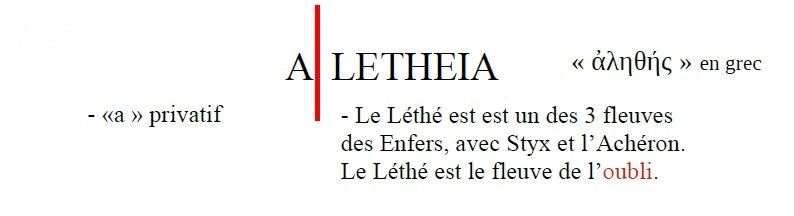
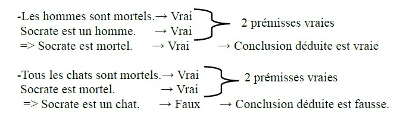
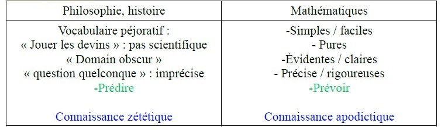
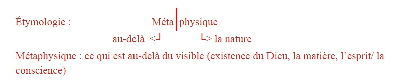
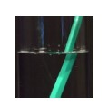
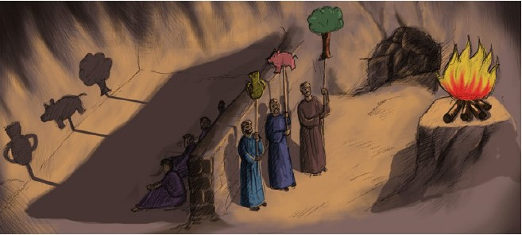
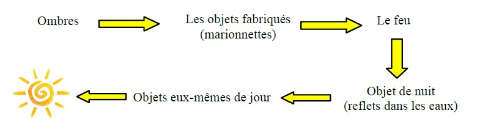
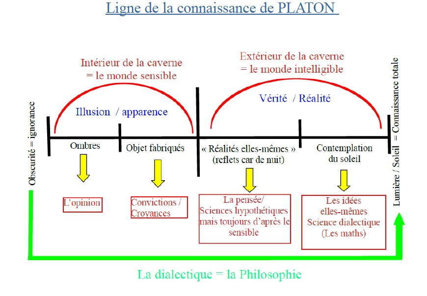

<meta chartes="utf-8" />
<html>
 <head>
 <meta name="viewport" content="width=device-width, initial-scale=1">
 
 </head>

 <body>
 <h1 id="para1">COMMENT PEUT-ON ÉTABLIR LA VÉRITÉ?</h1>
 <h2 id="para2">Quel est le lien entre la vérité et réalité ?</h2>
 <h2 id="para2">Quel est le lien entre la vérité est l’opinion ?</h2>
  
  
 
L'étymologie grecque du mot "Vérité":
  
 
  
 
  <b style="color:red;">La vérité serait donc le fait de ne pas oublier</b> les Idées que nos âmes ont contemplées avant de s’incarner.

  
  
 
 <u style="color:#0000FF;" size="25px"> 2 Positions scientifiques :</u>

 <ol>
     <li>
       
Les lois (divines) sont présentées dans le monde et il s’agit pour le scientifique de <b style="color:#00FF00;"> les découvrir </b> et <b style="color:#00FF00;"> de les dévoiler.</b>

     </li>
     <li>
       
Le scientifique invente les lois, les théories dans le but de tenter d’expliquer et de prévoir es phénomènes.

     </li>
 </ol>
   
 
<u><b>Emmanuel KANT, <i>Critique de la raison pure, II</i>, XVIIIe siècle (p. 524.)</b></u>

     <button type="button" class="collapsible">
<b>Emmanuel KANT</b>, « Théorie transcendantale de la méthode », Suffit-il qu'une pensée soit conforme à la logique pour qu'elle soit vrai?
 </button>

 

   
<i>Pour qu’une pensée soit vraie, c’est-à-dire conforme à l’objet dont elle ou nie ceci   ou cela (c’est une pomme, ce n’est pas une poire), il faut d’abord qu’elle soit en accord avec   elle-même. La logique définit en effet les règles qui s’imposent à toute pensée vraie. Une   pensée qui se contredit ne peut à l’évidence prétendre à quelque vérité que ce soit. Mais   cette forme logique de la pensée suffit-elle à garantir son accord avec un contenu donné ?</i>
     
     &nbsp;&nbsp; &nbsp;&nbsp;&nbsp;&nbsp; &nbsp;&nbsp; L'ancienne et célèbre question par laquelle on prétendait pousser à bout les logiciens
    &nbsp;&nbsp; &nbsp;&nbsp;&nbsp;&nbsp; &nbsp;&nbsp;  [...] est celle-ci : <i>Qu'est-ce que la vérité?</i> [...] <mark id="m1"> Mais pour ce qui regarde la connaissance,</mark>
    &nbsp;&nbsp; &nbsp;&nbsp;&nbsp;&nbsp; &nbsp;&nbsp;<mark id="m1">quant à sa forme simplement (abstraction faite de tout contenu)</mark>, il est […] clair 
    &nbsp;&nbsp; &nbsp;&nbsp; &nbsp;&nbsp; &nbsp;&nbsp;qu'une logique, en tant qu'elle traite des règles générales et nécessaires de l'enten-
    5 &nbsp;&nbsp; &nbsp;&nbsp;&nbsp;&nbsp; dement, doit exposer, dans ces règles mêmes, les critères de la vérité. Car ce qui les 
    &nbsp;&nbsp; &nbsp;&nbsp;&nbsp;&nbsp; &nbsp;&nbsp; contredit est faux, puisque l'entendement s'y met en contradiction avec les règles
    &nbsp;&nbsp; &nbsp;&nbsp;&nbsp;&nbsp; &nbsp;&nbsp; générales de sa pensée et, par suite,<mark id="m1"> avec lui-même</mark>.<mark id="m2"> Mais ces critères ne concernent </mark>
    &nbsp;&nbsp; &nbsp;&nbsp;&nbsp;&nbsp; &nbsp;&nbsp;<mark id="m2">que la forme de la vérité, c'est-à-dire de la pensée en général et, s'ils sont, à ce titre,</mark>
    &nbsp;&nbsp; &nbsp;&nbsp;&nbsp;&nbsp; &nbsp;&nbsp;<mark id="m2">très justes, ils sont pourtant insuffisants. Car une connaissance peut fort bien être</mark>
    10&nbsp;&nbsp;&nbsp;&nbsp; &nbsp;<mark id="m2">complètement conforme à la forme logique, c'est-à-dire ne pas se contredire elle-</mark>
    &nbsp;&nbsp; &nbsp;&nbsp;&nbsp;&nbsp; &nbsp;&nbsp;<mark id="m2">  même, et cependant être en contradiction avec l'objet</mark>. <mark id="m1">Donc le critère simplement</mark>
     &nbsp;&nbsp; &nbsp;&nbsp;&nbsp;&nbsp; &nbsp;&nbsp;<mark id="m1">logique de la vérité, c'est-à-dire l'accord d'une connaissance avec les lois générales </mark>
     &nbsp;&nbsp; &nbsp;&nbsp;&nbsp;&nbsp; &nbsp;&nbsp;<mark id="m1">et formelles de l'entendement et de la raison est, il est vrai, la condition<i> sine qua</i></mark>
     &nbsp;&nbsp; &nbsp;&nbsp;&nbsp;&nbsp; &nbsp;&nbsp;<mark id="m1"><i>non</i> et, par suite, la condition négative de toute vérité; mais la logique ne peut pas </mark>
     15 &nbsp;&nbsp; &nbsp;&nbsp;<mark id="m1">aller plus loin</mark> ;<mark id="m2"> aucune pierre de touche ne lui permet de découvrir l'erreur qui </mark>
     &nbsp;&nbsp; &nbsp;&nbsp;&nbsp;&nbsp; &nbsp;&nbsp;<mark id="m2">atteint non la forme, mais le contenu</mark>. La logique générale résout donc en ses élé-
     &nbsp;&nbsp; &nbsp;&nbsp;&nbsp;&nbsp; &nbsp;&nbsp;ments tout<mark id="m1"> le travail formel de l'entendement</mark> et de la raison et présente ces éléments
     &nbsp;&nbsp; &nbsp;&nbsp;&nbsp;&nbsp; &nbsp;&nbsp;comme principes de toute appréciation logique de notre connaissance. Cette partie
     &nbsp;&nbsp; &nbsp;&nbsp;&nbsp;&nbsp; &nbsp;&nbsp;de la logique [...] est par là même<mark id="m1"> la pierre de touche au moins négative de la vérité, </mark>
     20 &nbsp;&nbsp; &nbsp;&nbsp;puisqu'il faut tout d'abord examiner et apprécier toute connaissance, quant à sa
     &nbsp;&nbsp; &nbsp;&nbsp;&nbsp;&nbsp; &nbsp;&nbsp;forme, d'après ces règles,<mark id="m2"> avant de l'éprouver quant à son contenu, pour établir si,</mark>
     &nbsp;&nbsp; &nbsp;&nbsp;&nbsp;&nbsp; &nbsp;&nbsp;<mark id="m2">par rapport à l'objet, elle renferme une vérité positive</mark>. Mais, comme<mark id="m2"> la simple forme</mark>
    &nbsp;&nbsp; &nbsp;&nbsp;&nbsp;&nbsp; &nbsp;&nbsp;<mark id="m2">de la connaissance, aussi d'accord qu'elle puisse être avec les lois logiques, est bien</mark>
    &nbsp;&nbsp; &nbsp;&nbsp;&nbsp;&nbsp; &nbsp;&nbsp;<mark id="m2">loin par là de suffire à établir la vérité matérielle (objective) de la connaissance,</mark>
    25&nbsp;&nbsp; &nbsp;&nbsp;&nbsp;personne ne peut se risquer à l'aide de la logique seule, à juger des objets et à en
    &nbsp;&nbsp; &nbsp;&nbsp;&nbsp;&nbsp; &nbsp;&nbsp;affirmer la moindre des choses, sans en avoir entrepris auparavant une étude appro-
    &nbsp;&nbsp; &nbsp;&nbsp;&nbsp;&nbsp; &nbsp;&nbsp;fondie,<mark id="m2"> en dehors do la logique.</mark>
 

 

  
 
<b style="color:#0000FF;"><u>Comment établir une connaissance vrai sur le monde ?</u></b>

 
Pour établir la vérité d’une connaissance, les règles générales de la logique sont nécessaires : le principe de non contradiction, le principe de causalité.

 
<mark>De la ligne 1 à 7:</mark>
  &nbsp;&nbsp; &nbsp;&nbsp; &nbsp;&nbsp;→ Notre entendement suit les règles de la logique, déjà la forme de ses raisonnement.

 
<b style="color=#FF0000;">L’entendement (de Kant): C’est la faculté de créer des concepts, de faire la synthèse des différentes données de l’intuition sensible en les ordonnant à l’aide des catégories (causalité, espace, temps)</b>

  
 
<mark>De la ligne 7 à 11:</mark>
  &nbsp;&nbsp; &nbsp;&nbsp; &nbsp;&nbsp; → Les règles de la logique sont nécessaires mais pas suffisantes, car la vérité formelle se distingue de la vérité matérielle, c’est-à-dire une vérité concernant la contenu.
   &nbsp;&nbsp; &nbsp;&nbsp; &nbsp;&nbsp; Aristote est l’inventeur du syllogisme, constitué de 2 prémisses validées comme vraies et d’une conclusion déduite qui sera donc vraie :
   Exemple :

  

  
 
<mark>De la ligne 11 à 16:</mark>
  &nbsp;&nbsp; &nbsp;&nbsp; &nbsp;&nbsp;→ Vérité négative : nulle pensée ne peut être vraie, si elle ne respecte pas la logique. 

  
<mark>De la ligne 16 à 22:</mark>
  &nbsp;&nbsp; &nbsp;&nbsp; &nbsp;&nbsp;→ L’entendement suit les mêmes catégories (causalité, non-contradiction) que la logique.
  &nbsp;&nbsp; &nbsp;&nbsp; &nbsp;&nbsp;→ Notre connaissance du réel s’appuie sur cette logique., cette fidélité rigoureuse à la logique n’est pas suffisante pour dire quelque chose du réel qui soitvraie.

  
<mark>De la ligne 22 à 27:</mark>
  &nbsp;&nbsp; &nbsp;&nbsp; &nbsp;&nbsp;→ Nécessité d’étudier l’objet / la vérité pour lui-même, pour en posséder une connaissance vrai.

    
 
<b> Il existe 4 domaines de vérité :</b> 

 <ol style="list-style-type:lower-alpha">
     <li id="para3"> &nbsp;&nbsp; &nbsp;&nbsp; La vérité liée au langage:le discours tenu sur quelque chose doit être en adéquation (en accord) avec ce quelque chose. 
      &nbsp;&nbsp; &nbsp;&nbsp; &nbsp;&nbsp; &nbsp;&nbsp;  Exemple: La tour Eiffel est à Paris.
     &nbsp;&nbsp; &nbsp;&nbsp; &nbsp;&nbsp; &nbsp;&nbsp; =>Elle repose sur les faits.</li>
     <li id="para3"> &nbsp;&nbsp; &nbsp;&nbsp; La vérité mathématique: elle repose sur des démonstrations logiques.</li>
     <li id="para3"> &nbsp;&nbsp; &nbsp;&nbsp;La vérité des sciences expérimentales :
      &nbsp;&nbsp; &nbsp;&nbsp; &nbsp;&nbsp; &nbsp;&nbsp;- Elle repose sur un protocole: hypothèse/ expérimentation/ validation ou invalidation de la théorie.
      &nbsp;&nbsp; &nbsp;&nbsp; &nbsp;&nbsp; &nbsp;&nbsp;- Elle repose sur l’expérimentation.</li>     
     <li id="para3"> &nbsp;&nbsp; &nbsp;&nbsp; La vérité judiciaire : elle repose sur des preuves afin de déterminer l’innocence ou la culpabilité d’un prévenu.</li>
 </ol>
    
 
<b>3 Critères pour définir la qualité d’une théorie scientifique :</b>

 <ol style="list-style-type:upper-roman">
     <li id="para3"> &nbsp;&nbsp; &nbsp;&nbsp; Elle doit être la plus simple possible</li>
     <li id="para3">&nbsp;&nbsp; &nbsp;&nbsp; Elle doit pouvoir expliquer le plus de phénomènes possibles</li>
     <li id="para3"> &nbsp;&nbsp; &nbsp;&nbsp; Elle doit <mark> prévoir </mark>les phénomènes.</li>
 </ol>
 
    
 
<u><b>Thomas d’AQUIN (¡il est catholique!), <i>Sommes théologiques</i>, XIIIe siècle (p. 522.)</b></u>

     <button type="button" class="collapsible">
<b>Thomas d'AQUIN</b>, <i>Somme théologie</i>   Y a-t-il des choses vraies?
    </button>

 

  
<i>La vérité qualifie-t-elle un état de choses ou le  jugement que nous portons sur cet état de   choses ? N’est-elle pas une qualité de la pensée plutôt que des choses ? Ne désigne-t-elle pas   la pensée qui dit qu’une chose blanche est blanche, et l’erreur la pensée qui dit qu’une chose   est blanche lorsqu’elle ne l’est pas ? Dans ce texte, Thomas d’AQUIN soutient que la vérité   n’est pas une chose mais une relation, celle de l’adéquation de l’idée et de la chose.</i>
   
   &nbsp;&nbsp; &nbsp;&nbsp;&nbsp;&nbsp; &nbsp;&nbsp; On l'a déjà dit, le vrai, selon sa raison formelle première, est dans l'intelligence.
   &nbsp;&nbsp; &nbsp;&nbsp;&nbsp;&nbsp; &nbsp;&nbsp; Puisque toute chose est vraie selon qu'elle possède la forme qui est propre à sa 
   &nbsp;&nbsp; &nbsp;&nbsp;&nbsp;&nbsp; &nbsp;&nbsp; nature, il est nécessaire que l'intellect en acte de connaître soit vrai en tant qu'il y
   &nbsp;&nbsp; &nbsp;&nbsp; &nbsp;&nbsp; &nbsp;&nbsp;a en lui la similitude de la chose connue, similitude qui est sa forme propre en tant 
   5 &nbsp;&nbsp; &nbsp;&nbsp;&nbsp;&nbsp; qu'il est connaissant. Et c'est pour cela que l'on définit la vérité par la conformité
   &nbsp;&nbsp; &nbsp;&nbsp;&nbsp;&nbsp; &nbsp;&nbsp; de l'intellect et de la chose. Il en résulte que connaître une telle conformité, c'est 
   &nbsp;&nbsp; &nbsp;&nbsp;&nbsp;&nbsp; &nbsp;&nbsp; connaître la vérité.   

 

  
 
<mark>La ligne 1:</mark>
  &nbsp;&nbsp; &nbsp;&nbsp; &nbsp;&nbsp;→ La vérité est contenue dans notre intelligence parce que nous possédons unefaculté logique (que Dieu nous a donnée).

 
<mark>De la ligne 2 à 5:</mark>
  &nbsp;&nbsp; &nbsp;&nbsp; &nbsp;&nbsp;→ L’objet étudié est connaissable dans la mesure où il est en lien avec celuicherche à la connaître. Ce lien est fondé sur la création de cet objet et de celui qui cherche à connaître par Dieu.
  &nbsp;&nbsp; &nbsp;&nbsp; &nbsp;&nbsp;&nbsp;&nbsp; &nbsp;&nbsp; &nbsp;&nbsp; <b siz="25"> Ligne 3 : « L’intellect <mark style="color:#FF0000;"> en acte </mark> » => référence à ARISTOTE </b>
  &nbsp;&nbsp; &nbsp;&nbsp; &nbsp;&nbsp;&nbsp;&nbsp; &nbsp;&nbsp; &nbsp;&nbsp;&nbsp;&nbsp; &nbsp;&nbsp; &nbsp;&nbsp; &nbsp;&nbsp; &nbsp;&nbsp; &nbsp;&nbsp;&nbsp;&nbsp; &nbsp;&nbsp; &nbsp;&nbsp;&nbsp;&nbsp; &nbsp;&nbsp; &nbsp;&nbsp;&nbsp; &nbsp;&nbsp; &nbsp;  <i style="color:#FF0000;">└>  actif / agissant ≠ en puissance = virtuel, en devenir</i>
  &nbsp;&nbsp; &nbsp;&nbsp; &nbsp;&nbsp;&nbsp;&nbsp; &nbsp;&nbsp; &nbsp;&nbsp; Ex : La chenille est un papillon en puissance. 
 

 
<mark>De la ligne 5 à 7:</mark>
  &nbsp;&nbsp; &nbsp;&nbsp; &nbsp;&nbsp;→ Conformité de ce qui est saisi par l’intellect avec l’objet étudié.

    
 
<u><b>René DESCARTES, <i>Règles pour la direction de l’existence</i>, XVIIe siècle</b></u>

  <button type="button" class="collapsible">
<b> René DESCARTES</b>, <i>Règles pour la direction de l’esprit</i>  Les mathématiques comme modèle
</button>
 
 

  
<i>Le privilège des mathématiques comme modèle de vérité n’a rien d’arbitraire, selon Descartes. 
 Il vient du fait que leur objet est simple et abstrait, conçu hors de toute expérience. </i>
   
    &nbsp;&nbsp; &nbsp;&nbsp;&nbsp;&nbsp; &nbsp;&nbsp;&nbsp;De là se conclut avec évidence la raison pour laquelle l’arithmétique et la géométrie sont
    &nbsp;&nbsp; &nbsp;&nbsp;&nbsp;&nbsp; &nbsp;&nbsp;&nbsp;bien plus <mark id="m1">certaines</mark> que toutes les autres disciplines : c’est qu’elles seules traient d’un
    &nbsp;&nbsp; &nbsp;&nbsp; &nbsp;&nbsp; &nbsp;&nbsp;objet si pur et si simple qu’elles n’admettent absolument rien que l’expérience ait rendu
    &nbsp;&nbsp; &nbsp;&nbsp;&nbsp;&nbsp; &nbsp;&nbsp;&nbsp;incertain, et qu’elles consistent tout entières à tirer des conséquences par voie de déduction
    5 &nbsp;&nbsp; &nbsp;&nbsp;&nbsp;&nbsp;&nbsp;rationnelle. Elles sont ainsi les plus faciles et les plus claires de toutes, et elles ont un objet
    &nbsp;&nbsp; &nbsp;&nbsp;&nbsp;&nbsp; &nbsp;&nbsp; tel que celui que nous exigeons, puisqu’en elles, sauf inadvertance, il semble que l’homme 
    &nbsp;&nbsp; &nbsp;&nbsp;&nbsp;&nbsp; &nbsp;&nbsp;&nbsp;puisse difficilement se trompe. Il ne faut pas s’étonner pourtant si beaucoup d’esprits se
    &nbsp;&nbsp; &nbsp;&nbsp;&nbsp;&nbsp; &nbsp;&nbsp;&nbsp;portent spontanément plutôt vers d’autres disciplines ou vers la philosophie : cela vient,
    &nbsp;&nbsp; &nbsp;&nbsp;&nbsp;&nbsp; &nbsp;&nbsp;&nbsp;en effet, de ce que chacun se donne plus hardiment licence de jouer les devins1 dans un
    10&nbsp;&nbsp;&nbsp;&nbsp; &nbsp;&nbsp;domaine obscure que dans un domaine évident, et qu’il est bien plus facile d’entrevoir
    &nbsp;&nbsp; &nbsp;&nbsp;&nbsp;&nbsp; &nbsp;&nbsp;&nbsp;quelque chose à propos d’une question quelconque, que de parvenir sur une seule, si facile
    &nbsp;&nbsp; &nbsp;&nbsp;&nbsp;&nbsp; &nbsp;&nbsp;&nbsp;soit-elle, à la vérité elle-même.
    &nbsp;&nbsp; &nbsp;&nbsp;&nbsp;&nbsp; &nbsp;&nbsp;&nbsp;De tout cela il faut maintenant conclure, non point certes qu’on ne doivent étudier que
    &nbsp;&nbsp; &nbsp;&nbsp;&nbsp;&nbsp; &nbsp;&nbsp;&nbsp;l’arithmétique et la géométrie, mais seulement que ceux qui cherchent le droit chemin de 
    15 &nbsp;&nbsp;&nbsp; &nbsp;&nbsp;la vérité ne doivent s’occuper d’aucun objet à propos duquel ils ne puissent obtenir une 
    &nbsp;&nbsp; &nbsp;&nbsp;&nbsp;&nbsp;&nbsp; &nbsp;&nbsp;certitude égale aux démonstrations de l’arithmétique et de la géométrie.
     1- Qui prétend connaître ce qui est caché ou prédire l’avenir. 
    <mark id="m1"><u>Repères</u></mark>
    Certain : ne laisse subsister aucun doute, par opposition à ce qui n’est que probable. 
    Exemple: Descartes avec son <i>cogito</i> montre qu’il est certain que « Je suis, j’existe » par le fait que je pense rend impossible le fait que je ne sois pas.
   

 

  
 
<mark>Idée générale </mark>: Apologie des mathématiques comme moyen sûr d’atteindre la vérité.Descartes voulait mettre le monde sous forme mathématique : <i style="color:#FF0000;">Mathesis Universalis</i>

 
<mark>De la ligne 1 à 5</mark>: 
   Évidence (du latin <i>"videre"</i>) : voir avec l’esprit
  Certaine : qui ne laisse pas de place au doute. 
   Pur : Il n’y a pas l’implication ou l’intervention des sens, les mathématiques sont intellectuelles, abstraites
  Simple : On peut décomposer les mathématiques jusqu’au plus petit élément.
  &nbsp;&nbsp; &nbsp;&nbsp; &nbsp;&nbsp;→ Les mathématiques s’appuient sur des démonstrations rationnelles.

 
<mark>De la ligne 5 à 7</mark>: 
    Claires : évidentes, par l’intuition de l’esprit
  L’Erreur (du latin <i> error/ errare</i>) : errer, se tromper du chemin, perdre 
  &nbsp;&nbsp; &nbsp;&nbsp; &nbsp;&nbsp;→ Les mathématiques sont un outil, un moyen, d’éviter l’erreur.
 

 
<mark>De la ligne 5 à 12</mark>: 
  

 

      
 
<mark>De la ligne 13 à 16</mark>:
   &nbsp;&nbsp; &nbsp;&nbsp; &nbsp;&nbsp;→ L’arithmétique et la géométrie sont le plus sûr moyen d’accéder à la vérité. 

    
 
<u><b>Karl POPPER, <i>Conjectures et réfutations</i>, XXe siècle</b></u>

  

   <button type="button" class="collapsible">
<b>Karl POPPER</b>, <i>Conjectures et réfutations</i>, 1963  L’irréfutabilité est un défaut  <b>ET </b>L’épreuve du test (<i> La logique de la découverte scientifique</i>,1934
  </button>
 
 

    
<i> Une théorie serait-elle scientifique parce qu’elle est infaillible et irréfutable ? C’est exactement   l’inverse selon Karl Popper, qui entend opposer à la science ce qui relève de la métaphysique,  de la religion ou de l’idéologie. </i>
   
   &nbsp;&nbsp; &nbsp;&nbsp;&nbsp;&nbsp; &nbsp;&nbsp; Une théorie qui n’est réfutable par aucun événement qui se puisse concevoir est dépourvue 
   &nbsp;&nbsp; &nbsp;&nbsp;&nbsp;&nbsp; &nbsp;&nbsp; de caractère scientifique. Pour les théories, l’irréfutable n’est pas (comme on l’imagine
   &nbsp;&nbsp; &nbsp;&nbsp;&nbsp;&nbsp; &nbsp;&nbsp;&nbsp;souvent) vertu mais défaut.
   &nbsp;&nbsp; &nbsp;&nbsp; &nbsp;&nbsp; &nbsp;&nbsp;Toute mise à l’épreuve véritable d’une théorie par des tests constitue une tentative pour 
   5 &nbsp;&nbsp; &nbsp;&nbsp;&nbsp;&nbsp; en démontrer la fausseté ou pour la réfuter. Pouvoir être testée c’est pouvoir être réfutée ;
   &nbsp;&nbsp; &nbsp;&nbsp;&nbsp;&nbsp; &nbsp;&nbsp; mais cette propriété comporte des degrés: certaines théories se prêtent plu aux tests, s’y 
   &nbsp;&nbsp; &nbsp;&nbsp;&nbsp;&nbsp; &nbsp;&nbsp; exposent davantage à la réfutation que les autres, elles prennent, en quelque sorte, de plus 
   &nbsp;&nbsp; &nbsp;&nbsp;&nbsp;&nbsp; &nbsp;&nbsp; grandes risques.
   
   
 <i>Les théories ou « systèmes » doivent pouvoir être soumis à « tests expérimentaux » pour  mériter d’être considérés comme authentiquement scientifiques.</i>
   
   &nbsp;&nbsp; &nbsp;&nbsp;&nbsp;&nbsp; &nbsp;&nbsp; Un système n’est empirique1 ou scientifique que s’il est susceptible d’être soumis à des tests 
   &nbsp;&nbsp; &nbsp;&nbsp;&nbsp;&nbsp; &nbsp;&nbsp; expérimentaux. Ces considérations suggèrent que c’est la falsifiabilité et non vérifiabilité 
   &nbsp;&nbsp;&nbsp; &nbsp;&nbsp;&nbsp;&nbsp; &nbsp;&nbsp;d’un système qu’il faut prendre comme critère de démonstration. En d’autres termes, je 
   &nbsp;&nbsp; &nbsp;&nbsp; &nbsp;&nbsp; &nbsp;&nbsp;n’exigerai pas d’un système scientifique qu’il puisse être choisi une fois pour toutes, dans
   5 &nbsp;&nbsp; &nbsp;&nbsp;&nbsp;&nbsp; une acceptation positive2 mais j’exigerai que sa forme logique soit telle qu’il puisse être
   &nbsp;&nbsp; &nbsp;&nbsp;&nbsp;&nbsp; &nbsp;&nbsp; distingué, au moyen de tests empiriques, dans une acceptation négative : un système faisant 
   &nbsp;&nbsp;&nbsp; &nbsp;&nbsp;&nbsp;&nbsp;&nbsp;&nbsp;&nbsp;partie de la science empirique doit pouvoir être réfuté par l’expérience. (Ainsi l’énoncé 
   &nbsp;&nbsp; &nbsp;&nbsp;&nbsp;&nbsp; &nbsp;&nbsp; « il pleuvra ou il ne pleuvra pas ici demain » ne sert-t-il pas considéré comme empirique 
   &nbsp;&nbsp; &nbsp;&nbsp;&nbsp;&nbsp; &nbsp;&nbsp; pour simple raison qu’il ne peut être réfuté, alors que l’énoncé « il pleuvra ici demain »
    10&nbsp;&nbsp;&nbsp;&nbsp; &nbsp;&nbsp;sera considéré comme empirique). 
   
   1-Une connaissance empirique est fondée sur l’expérience et non sur des idées innées, sur l’intuition ou sur la pure raison. 
   2- Pour Popper, un système scientifique n’a pas positivement une propriété qui permettrait de le ranger définitivement du côté de la vérité : il n’est vrai que « négativement » autrement dit aussi longtemps qu’il n’a pas été réfuté par l’expérience – ce qui suppose qu’il puisse l’être. 
   

 

 
 &nbsp;&nbsp; &nbsp;&nbsp; &nbsp;&nbsp;→  Une théorie est scientifique si et seulement si elle est réfutable.
    &nbsp;&nbsp; &nbsp;&nbsp; &nbsp;&nbsp; &nbsp;&nbsp; &nbsp;&nbsp; &nbsp;&nbsp; &nbsp;&nbsp; &nbsp;&nbsp; &nbsp;&nbsp; &nbsp;&nbsp; &nbsp;&nbsp; &nbsp;&nbsp; &nbsp;&nbsp; &nbsp;&nbsp; &nbsp;&nbsp; &nbsp;&nbsp; &nbsp;&nbsp; &nbsp;&nbsp; &nbsp;&nbsp; &nbsp;&nbsp; &nbsp;&nbsp; &nbsp;&nbsp; &nbsp;&nbsp; &nbsp;&nbsp;   &nbsp;&nbsp; &nbsp;&nbsp; &nbsp;&nbsp; &nbsp;&nbsp; &nbsp;&nbsp; &nbsp;&nbsp; &nbsp;&nbsp; &nbsp;&nbsp; &nbsp;&nbsp; &nbsp;&nbsp;  <b style="color:red">  └> La falsifiabilité
   &nbsp;&nbsp; &nbsp;&nbsp; &nbsp;&nbsp; &nbsp;&nbsp; &nbsp;&nbsp; &nbsp;&nbsp; &nbsp;&nbsp; &nbsp;&nbsp; &nbsp;&nbsp; &nbsp;&nbsp; &nbsp;&nbsp; &nbsp;&nbsp;  &nbsp;&nbsp;  &nbsp;&nbsp; &nbsp;&nbsp; &nbsp;&nbsp; &nbsp;&nbsp; &nbsp;&nbsp; &nbsp;&nbsp; &nbsp;&nbsp; &nbsp;&nbsp; &nbsp;&nbsp; &nbsp;&nbsp; &nbsp;&nbsp; &nbsp;&nbsp; &nbsp;&nbsp; &nbsp;&nbsp; &nbsp;&nbsp; &nbsp;&nbsp; &nbsp;&nbsp; &nbsp;&nbsp; &nbsp;&nbsp; &nbsp;&nbsp; &nbsp;&nbsp; &nbsp;&nbsp; &nbsp;&nbsp;  La réfutabilité </b>
  Elle doit être testée et éprouvée. 

 
<u style="color:#00FF00">2 Théories qui ne sont pas scientifiques pour Karl POPPER :</u>

 <ol type="A">
     <li id="para3">Théorie de l’existence de l’inconscient (S. FREUD, 1912) </li>
     <li id="para3">Théorie de la lutte des classes (Karl MARX, 1948) </li>
 </ol>
    
 
<u><b>Albert EINSTEIN et Léopold INFELD, <i>L’évolution des idées en physique</i>, XXe siècle</b></u>

   
   <button type="button" class="collapsible">
<b>Albert EINSTEIN et Léopold INFELD</b>, <i>L’évolution des idées en physique</i>, 1936  La vérité n'est qu'une limite idéale 
  </button>
 
 

    
<i>On pourrait croire que, parmi les sciences, la physique soit celle qui soit la plus proche d’une description fidèle de la 
  réalité naturelle. Pourtant la vérité n’est pour elle qu’un horizon, considèrent Albert Einstein et Léopold Infeld.</i>
   
   &nbsp;&nbsp; &nbsp;&nbsp;&nbsp;&nbsp; &nbsp;&nbsp; C’est en réalité tout notre système de conjectures1 qui
   &nbsp;&nbsp; &nbsp;&nbsp;&nbsp;&nbsp; &nbsp;&nbsp;  doit être prouvé ou réfuté par l’expérience. Aucune de
   &nbsp;&nbsp; &nbsp;&nbsp;&nbsp;&nbsp; &nbsp;&nbsp;&nbsp;ces suppositions ne peut être isolée pour être examinée 
   &nbsp;&nbsp; &nbsp;&nbsp; &nbsp;&nbsp; &nbsp;&nbsp;séparément. Dans le cas des planètes qui se meuvent 
   5 &nbsp;&nbsp; &nbsp;&nbsp;&nbsp;&nbsp; autour du soleil, on trouve que le système de la mécanique 
   &nbsp;&nbsp; &nbsp;&nbsp;&nbsp;&nbsp; &nbsp;&nbsp; est remarquablement opérant. Nous pouvons
   &nbsp;&nbsp; &nbsp;&nbsp;&nbsp;&nbsp; &nbsp;&nbsp; néanmoins imaginer un autre système, basé sur des
   &nbsp;&nbsp; &nbsp;&nbsp;&nbsp;&nbsp; &nbsp;&nbsp;  suppositions différentes, qui soit opérant au même degré.
   &nbsp;&nbsp; &nbsp;&nbsp;&nbsp;&nbsp; &nbsp;&nbsp; Les concepts physiques sont des créations libres de l’esprit humain et ne sont pas, comme
   10&nbsp;&nbsp;&nbsp;&nbsp;&nbsp; &nbsp;on pourrait le croire, uniquement déterminés par le monde extérieur. Dans l’effort que 
   &nbsp;&nbsp; &nbsp;&nbsp;&nbsp;&nbsp; &nbsp;&nbsp; nous faisons pour comprendre le monde, nous ressemblons quelque peu à l’homme qui 
   &nbsp;&nbsp; &nbsp;&nbsp;&nbsp;&nbsp; &nbsp;&nbsp; essaie de comprendre le mécanisme d’une montre fermée. Il voit le cadran et les aiguilles
   &nbsp;&nbsp; &nbsp;&nbsp;&nbsp;&nbsp; &nbsp;&nbsp; en mouvement, il entend le tic-tac, mais il n’a aucun moyen d’ouvrir le boîtier. S’il est ingénieux
   &nbsp;&nbsp; &nbsp;&nbsp;&nbsp;&nbsp; &nbsp;&nbsp; il pourra se former quelque image du mécanisme, qu’il rendra responsable de tout ce 
   15 &nbsp;&nbsp;&nbsp; &nbsp;&nbsp;qu’il observe, mais il ne sera jamais sûr que son image soit la seule capable d’expliquer ses
   &nbsp;&nbsp; &nbsp;&nbsp;&nbsp;&nbsp; &nbsp;&nbsp; observations. Il ne sera jamais en état de comparer son image avec le mécanisme <mark id="m1"> réel</mark>, et il 
   &nbsp;&nbsp; &nbsp;&nbsp;&nbsp;&nbsp; &nbsp;&nbsp; ne peut même pas se représenter la possibilité ou la signification d’une telle comparaison.
   &nbsp;&nbsp; &nbsp;&nbsp;&nbsp;&nbsp; &nbsp;&nbsp; Mais le chercheur croit certainement qu’à mesure que ses connaissances s’accroîtront, 
   &nbsp;&nbsp; &nbsp;&nbsp;&nbsp;&nbsp; &nbsp;&nbsp; son image de la réalité deviendra de plus en plus simple et expliquera des domaines de 
   20&nbsp; &nbsp;&nbsp; &nbsp;&nbsp;plus en plus étendus de ses impressions sensibles. Il pourra aussi croire à l’existence d’une
   &nbsp;&nbsp; &nbsp;&nbsp;&nbsp;&nbsp; &nbsp;&nbsp;  limite <mark id="m2"> idéale</mark> de la connaissance que l’esprit humain peut atteindre. Il pourra appeler cette
   &nbsp;&nbsp; &nbsp;&nbsp;&nbsp;&nbsp; &nbsp;&nbsp;  limite idéale la vérité objective."
   
   1- une conjecture est une hypothèse de travail qui n’a encore reçu ni confirmation ni infirmation. Elle donc provisoire et peut servir d’hypothèse de travail  pour résoudre un problème ou mener un raisonnement. 
   <mark id="m1"><u>Repères</u></mark>
    ⟾Quand le texte évoque une limite <mark id="m2"> idéale</mark>, il s’agit d’une limite indéterminée, qu’on n’atteindra peut-être jamais, par opposition à ce qui serait une limite <mark id="m1">réelle</mark>, affective et indépassable. 
    Exemple: On peut aussi opposer une beauté idéale, pure et absolue, sans aucun défaut mais qui n'existe qu'en idée, aux beautés réelles auxquelles on peut toujours reprocher telle ou telle imperfection.  
   

 

   

 
<b style="color:#BF0000;"> Étymologie : physis (en grecque: φύσις) → Physique
  &nbsp;&nbsp; &nbsp;&nbsp; &nbsp;&nbsp; &nbsp;&nbsp; &nbsp;&nbsp; &nbsp;&nbsp; &nbsp;&nbsp; &nbsp;&nbsp; &nbsp;&nbsp;  └> la nature </b>

 
<mark>De la ligne 1 à 8</mark>:
   &nbsp;&nbsp; &nbsp;&nbsp; &nbsp;&nbsp;→ La science est « système de conjectures »
   Système : ensemble dont les éléments coordonnées par une loi, une théorie
  Conjecture : hypothèse
  &nbsp;&nbsp; &nbsp;&nbsp; &nbsp;&nbsp;Ex : Le système solaire est basé sur le système de la mécanique.

 
<mark>De la ligne 9 à 12</mark>:
   &nbsp;&nbsp; &nbsp;&nbsp; &nbsp;&nbsp;→ La science est une création humaine, de l’intellect. Le but est de tenter d’expliquer les phénomènes.
  &nbsp;&nbsp; &nbsp;&nbsp; &nbsp;&nbsp; => Métaphore de la montre fermée. 

 
<mark>De la ligne 12 à 17</mark>:
    &nbsp;&nbsp; &nbsp;&nbsp; &nbsp;&nbsp; « voit » / « entend »  ⟾À l’aide de nos sens, nous percevons les phénomènes.
   &nbsp;&nbsp; &nbsp;&nbsp; &nbsp;&nbsp;  → « Boîtier fermé » renvoie à notre impossibilité de comprendre comment ces phénomènes ont lieu.

 
<mark>De la ligne 18 à 22</mark>: &nbsp;&nbsp; &nbsp;&nbsp; &nbsp;&nbsp; &nbsp;&nbsp; &nbsp;&nbsp; &nbsp;&nbsp; &nbsp;&nbsp; &nbsp;&nbsp; &nbsp;&nbsp; &nbsp;&nbsp; &nbsp;&nbsp; &nbsp;&nbsp; &nbsp;&nbsp; &nbsp;&nbsp; &nbsp;&nbsp; &nbsp;&nbsp; &nbsp;&nbsp; &nbsp;&nbsp;  &nbsp;&nbsp; &nbsp;&nbsp; &nbsp;&nbsp; &nbsp;&nbsp; &nbsp;&nbsp; &nbsp;&nbsp; &nbsp;&nbsp; &nbsp;&nbsp; &nbsp;&nbsp;  &nbsp;&nbsp; &nbsp;&nbsp; &nbsp;&nbsp; &nbsp;&nbsp; &nbsp;&nbsp; &nbsp;&nbsp; &nbsp;&nbsp; &nbsp;&nbsp; &nbsp;&nbsp;  <u id="para10">Repère : Savoir ≠ Croire</u>
   &nbsp;&nbsp; &nbsp;&nbsp; &nbsp;&nbsp;→ CROYANCES :
 <ol>
     <li id="para3">Le chercheur pense que plus il possède de connaissance sur le monde, plus la réalité deviendra simple, plus elle sera saisissable.</li>
     <li id="para3">Il saura expliquer de plus en plus de phénomènes.</li>
 </ol>
 
 ¡ FAUX !  Car, plus on connaît d’éléments, plus on prend connaissance de notre ignorance, de tout ce que l’on a encore à comprendre. 

 
&nbsp;&nbsp; &nbsp;&nbsp; &nbsp;&nbsp; → La vérité se pose comme un horizon à atteindre, une limite idéale.
  vérité objective » : c’est un pléonasme, car la vérité, par définition, est objective, voire universelle.
  &nbsp;&nbsp; &nbsp;&nbsp; &nbsp;&nbsp;- La science est le produit d’une communauté scientifique constituée d’humains: donc les théories sont objectives :
  &nbsp;&nbsp; &nbsp;&nbsp; &nbsp;&nbsp; &nbsp;&nbsp; &nbsp;&nbsp; &nbsp;&nbsp; &nbsp;&nbsp; &nbsp;&nbsp; &nbsp;&nbsp; &nbsp;&nbsp; &nbsp;&nbsp; &nbsp;&nbsp; &nbsp;&nbsp; &nbsp;&nbsp; &nbsp;&nbsp; &nbsp;&nbsp; &nbsp;&nbsp; &nbsp;&nbsp;  &nbsp;&nbsp; &nbsp;&nbsp; &nbsp;&nbsp; &nbsp;&nbsp; &nbsp;&nbsp; &nbsp;&nbsp; &nbsp;&nbsp; &nbsp;&nbsp; &nbsp;&nbsp;  &nbsp;&nbsp; &nbsp;&nbsp; &nbsp;&nbsp; &nbsp;&nbsp; &nbsp;&nbsp; &nbsp;&nbsp; &nbsp;&nbsp; &nbsp;&nbsp; &nbsp;&nbsp;&nbsp;&nbsp; &nbsp;&nbsp; &nbsp;&nbsp;&nbsp;&nbsp; &nbsp;&nbsp; &nbsp;&nbsp;&nbsp;&nbsp; &nbsp;&nbsp; &nbsp;&nbsp; <u id="para10">Repère : objectif ≠ subjectif </u>
  &nbsp;&nbsp; &nbsp;&nbsp; &nbsp;&nbsp; - Les phénomènes sont observés à l’aide des sens : donc perception subjective. 

    
 
<u><b>René DESCARTES, <i>Méditations métaphysiques</i>, XVIIIe siècle</b></u>

   <button type="button" class="collapsible">
<b>René DESCARTES</b>, <i>Méditations métaphysiques</i>,1641  Trouver un fondement sûr à nos connaissances
 </button>

 

     
<i>Dans un contexte historique où le système géocentrique est remis en cause par Copernic puis  par Galilée,il est urgent, pour Descartes, de se demander s'il peut trouver une première certitude  qui lui servira de fondement. Après avoir entrepris de douter de tout, dans cette deuxième  méditation, il émet l'hypothèse d'un malin génie qui le tromperait constamment.</i> 
     
    &nbsp;&nbsp; &nbsp;&nbsp;&nbsp;&nbsp; &nbsp;&nbsp;&nbsp;&nbsp; &nbsp;&nbsp;&nbsp;&nbsp; &nbsp;&nbsp; Je suppose donc que toutes les choses que je vois sont fausses ; je me persuade que
    &nbsp;&nbsp; &nbsp;&nbsp;&nbsp;&nbsp; &nbsp;&nbsp; rien n'a jamais été de tout ce que ma mémoire remplie de mensonges me représente ;
    &nbsp;&nbsp; &nbsp;&nbsp;&nbsp;&nbsp; &nbsp;&nbsp; je pense n'avoir aucun sens ; je crois que le corps, la figure, l'étendue, le mouvement et
    &nbsp;&nbsp; &nbsp;&nbsp; &nbsp;&nbsp; &nbsp;&nbsp;le lieu ne sont que des fictions de mon esprit. Qu'est-ce donc qui pourra être estimé
    5 &nbsp;&nbsp; &nbsp;&nbsp;&nbsp;&nbsp;  véritable ? Peut-être rien autre chose, sinon qu'il n'y a rien au monde de certain.
    
    &nbsp;&nbsp; &nbsp;&nbsp;&nbsp;&nbsp; &nbsp;&nbsp; &nbsp;&nbsp; &nbsp;&nbsp;&nbsp;&nbsp; &nbsp;&nbsp; Mais que sais-je s'il n'y a point quelque autre chose différente de celles que je 
    &nbsp;&nbsp; &nbsp;&nbsp;&nbsp;&nbsp; &nbsp;&nbsp;&nbsp;viens de juger incertaines, de laquelle on ne puisse avoir le moindre doute ? N'y 
    &nbsp;&nbsp; &nbsp;&nbsp;&nbsp;&nbsp; &nbsp;&nbsp; a-t-il point quelque Dieu, ou quelque autre puissance, qui me met en l'esprit ces
    &nbsp;&nbsp; &nbsp;&nbsp;&nbsp;&nbsp; &nbsp;&nbsp; pensées ? Cela n'est pas nécessaire ; car peut-être que je suis capable de les produire
    10&nbsp;&nbsp;&nbsp;&nbsp; &nbsp;&nbsp;de moi-même. Moi donc à tout le moins ne suis-je pas quelque chose ? Mais j'ai 
    &nbsp;&nbsp; &nbsp;&nbsp;&nbsp;&nbsp; &nbsp;&nbsp; déjà nié que j'eusse aucun sens ni aucun corps. J'hésite néanmoins, car que s'ensuit-il
    &nbsp;&nbsp; &nbsp;&nbsp;&nbsp;&nbsp; &nbsp;&nbsp;&nbsp;de là ? Suis-je tellement dépendant du corps et des sens, que je ne puisse
    &nbsp;&nbsp; &nbsp;&nbsp;&nbsp;&nbsp; &nbsp;&nbsp; être sans eux ? Mais je me suis persuadé qu'il n'y avait rien du tout dans le monde,
    &nbsp;&nbsp; &nbsp;&nbsp;&nbsp;&nbsp; &nbsp;&nbsp;  qu'il n'y avait aucun ciel, aucune terre, aucun esprit, ni aucun corps ; ne me suis-je
    15 &nbsp;&nbsp; &nbsp;&nbsp;&nbsp;donc pas aussi persuadé que je n'étais point ? Non certes, j'étais sans doute, si je
    &nbsp;&nbsp; &nbsp;&nbsp;&nbsp;&nbsp; &nbsp;&nbsp;  me suis persuadé, ou seulement si j'ai pensé quelque chose. Mais il y a un je ne 
    &nbsp;&nbsp; &nbsp;&nbsp;&nbsp;&nbsp; &nbsp;&nbsp;&nbsp;sais quel trompeur très puissant et très rusé, qui emploie toute son industrie à
    &nbsp;&nbsp; &nbsp;&nbsp;&nbsp;&nbsp; &nbsp;&nbsp;  me tromper toujours. Il n'y a donc point de doute que je suis, s'il me trompe ; 
    &nbsp;&nbsp; &nbsp;&nbsp;&nbsp;&nbsp; &nbsp;&nbsp; et qu'il me trompe tant qu'il voudra il ne saurait jamais faire que je ne sois rien,
    20 &nbsp;&nbsp; &nbsp;&nbsp; tant que je penserai être quelque chose. De sorte qu'après y avoir bien pensé, et
    &nbsp;&nbsp; &nbsp;&nbsp;&nbsp;&nbsp; &nbsp;&nbsp;  avoir soigneusement examiné toutes choses, enfin il faut conclure, et tenir pour
    &nbsp;&nbsp; &nbsp;&nbsp;&nbsp;&nbsp; &nbsp;&nbsp; constant que cette proposition : Je suis, j'existe, est nécessairement vraie, toutes
    &nbsp;&nbsp; &nbsp;&nbsp;&nbsp;&nbsp; &nbsp;&nbsp; les fois que je la prononce, ou que je la conçois en mon esprit.
    
    &nbsp;&nbsp; &nbsp;&nbsp;&nbsp;&nbsp; &nbsp;&nbsp; &nbsp;&nbsp; &nbsp;&nbsp;&nbsp;&nbsp; &nbsp;&nbsp; Mais je ne connais pas encore assez clairement ce que je suis, moi qui suis
    25&nbsp;&nbsp; &nbsp;&nbsp;&nbsp; certain que je suis ; de sorte que désormais il faut que je prenne soigneusement
    &nbsp;&nbsp; &nbsp;&nbsp;&nbsp;&nbsp; &nbsp;&nbsp; garde de ne prendre pas imprudemment quelque autre chose pour moi, et ainsi de
    &nbsp;&nbsp; &nbsp;&nbsp;&nbsp;&nbsp; &nbsp;&nbsp;  ne me point méprendre dans cette connaissance, que je soutiens être plus certaine
    &nbsp;&nbsp; &nbsp;&nbsp;&nbsp;&nbsp; &nbsp;&nbsp; et plus évidente que toutes celles que j'ai eues auparavant. 
   

 

  
 
<b style="color:#BF0000;">
  
 
  Étymologie :Étymologie : &nbsp;&nbsp; &nbsp;&nbsp; &nbsp;&nbsp; &nbsp;&nbsp; &nbsp;&nbsp; &nbsp;&nbsp; &nbsp;&nbsp; &nbsp;&nbsp; &nbsp;Méta    physique  
 &nbsp;&nbsp; &nbsp;&nbsp; &nbsp;&nbsp; &nbsp;&nbsp; &nbsp;&nbsp; &nbsp;&nbsp; &nbsp;&nbsp; &nbsp;&nbsp; &nbsp;&nbsp;&nbsp; &nbsp;&nbsp; &nbsp;&nbsp; &nbsp;&nbsp; &nbsp;&nbsp; &nbsp;&nbsp; &nbsp;&nbsp; &nbsp;&nbsp; &nbsp;&nbsp;&nbsp; &nbsp;&nbsp; au-delà <┘&nbsp;&nbsp; &nbsp;&nbsp; └> la nature
  Métaphysique : ce qui est au-delà du visible (existence du Dieu, la matière, l’esprit/ la conscience)</b>

 
&nbsp;&nbsp; &nbsp;&nbsp; &nbsp;&nbsp;→ Il cherche une vérité indubitable (=dont on ne peut douter) sur laquelle il pourra faire sa philosophie.
  Pour trouver cette vérité sûre et certaine, il va remettre en question : 

 <ol>
     <li>

Les connaissances qui viennent des sens, parce que les sens nous trompent : les illusions d’optique (tour perçue comme petite car éloignée, bâton dans l’eau, membres fantômes)
</li>
     <li id="para3">Les connaissances déduites des mathématiques, parce que nous pouvons nous tromper dans nos raisonnements  (paralogisme)</li>
     <li id="para3">Tout les autres connaissances :
      &nbsp;&nbsp; &nbsp;&nbsp; &nbsp;&nbsp;&nbsp;&nbsp; &nbsp;&nbsp; &nbsp;&nbsp;- un malin génie qui lui a mis des idées fausses dans la tête, donc qui le trompe
      &nbsp;&nbsp; &nbsp;&nbsp; &nbsp;&nbsp;&nbsp;&nbsp; &nbsp;&nbsp; &nbsp;&nbsp;- on ne distingue pas les rêves de l’éveil
      <b style="color:#00FF00;">Faire table rase (tabula rasa)</b></li>
 </ol>
 

 
&nbsp;&nbsp; &nbsp;&nbsp; &nbsp;&nbsp;Si, je remets en question mes connaissances, c’est que je doute de celles-ci ; ci je doute, c’est donc que quelque chose pense en moi, si quelque chose pense en moi, c’est donc j’existe.
 
<b>Cogito ergo sum   Je pense donc je suis (j’existe)</b>

  
 
&nbsp;&nbsp; &nbsp;&nbsp; &nbsp;&nbsp; &nbsp;&nbsp; => La vérité 1re à laquelle il aboutit.
  &nbsp;&nbsp; &nbsp;&nbsp; &nbsp;&nbsp; &nbsp;&nbsp; => Le doute cartésien est radical, hyperbolique, <u>méthod</u>ique (par étapes)
    &nbsp;&nbsp; &nbsp;&nbsp; &nbsp;&nbsp; &nbsp;&nbsp; &nbsp;&nbsp; &nbsp;&nbsp; &nbsp;&nbsp; &nbsp;&nbsp; &nbsp;&nbsp;&nbsp; &nbsp;&nbsp; &nbsp;&nbsp; &nbsp;&nbsp;&nbsp;&nbsp; &nbsp;&nbsp; &nbsp;&nbsp; &nbsp;&nbsp; &nbsp;&nbsp;&nbsp; &nbsp;&nbsp; &nbsp;&nbsp; &nbsp;&nbsp; &nbsp;&nbsp; &nbsp;&nbsp; &nbsp;&nbsp;&nbsp; &nbsp;&nbsp;└> "Chemin" en latin
   &nbsp;&nbsp; &nbsp;&nbsp; &nbsp;&nbsp; &nbsp;&nbsp;&nbsp;&nbsp; &nbsp;&nbsp; &nbsp;&nbsp; &nbsp;&nbsp;Mais, il aboutit à une vérité, donc il est fécond. 
  

  
&nbsp;&nbsp; &nbsp;&nbsp; &nbsp;&nbsp; &nbsp;&nbsp; Ce doute est fécond car il aboutit à cette vérité, au contraire du doute des Sceptiques, qui demeure stérile. En effet, ce courant a été fondé vers 300 ans avant notre ère, par PYRRHON D’ÉLIS : pour les Sceptiques, il n’y a pas de vérité accessible aux Hommes, ou bien on peut défendre tout et son contraire.

     

 
<u><b>René DESCARTES, <i>Méditations métaphysiques</i>, XVIIIe siècle</b></u>

   <button type="button" class="collapsible">
<b>René DESCARTES</b>, <i>Méditations métaphysiques</i>, 1641  Les sens ne suffisent pas pour connaître
    </button>

 

   
<i>Après s'être défini comme « une chose qui pense », Descartes se demande ce qu'il peut connaître  du monde. Malgré les changements d'état d'un morceau de cire chauffé, et donc son changement  d'apparence sensorielle, nous ne doutons pas qu'il s'agisse bel et bien du même morceau  de cire. C'est notre jugement qui s'impose à la perception du morceau de cire : nous ne recevons  pas passivement des informations des sens, nous jugeons la réalité perçue.</i>
    
    &nbsp;&nbsp; &nbsp;&nbsp;&nbsp;&nbsp; &nbsp;&nbsp; &nbsp;&nbsp; &nbsp;&nbsp;&nbsp;&nbsp; &nbsp;&nbsp; Prenons pour exemple ce morceau de cire : il vient tout 
    &nbsp;&nbsp; &nbsp;&nbsp;&nbsp;&nbsp; &nbsp;&nbsp; fraîchement d'être tiré de la ruche, il n'a pas encore perdu  
    &nbsp;&nbsp; &nbsp;&nbsp;&nbsp;&nbsp; &nbsp;&nbsp; la douceur du miel qu'il contenait, il retient encore quelque
    &nbsp;&nbsp; &nbsp;&nbsp; &nbsp;&nbsp;&nbsp;&nbsp; chose de l'odeur des fleurs dont il a été recueilli ; sa couleur, 
    5 &nbsp;&nbsp; &nbsp;&nbsp;&nbsp;&nbsp; sa figure, sa grandeur sont apparentes ; il est dur, il est
    &nbsp;&nbsp; &nbsp;&nbsp;&nbsp;&nbsp; &nbsp;&nbsp;  froid, il est maniable, et si vous frappez dessus, il rendra
    &nbsp;&nbsp; &nbsp;&nbsp;&nbsp;&nbsp; &nbsp;&nbsp; quelque son. Enfin toutes les choses qui peuvent distinctement
    &nbsp;&nbsp; &nbsp;&nbsp;&nbsp;&nbsp; &nbsp;&nbsp; faire connaître un corps se rencontrent en celui-ci.
    
    &nbsp;&nbsp; &nbsp;&nbsp;&nbsp;&nbsp; &nbsp;&nbsp;&nbsp;&nbsp; &nbsp;&nbsp;&nbsp;&nbsp; &nbsp;&nbsp; Mais voici que pendant que je parle, on l'approche du
    10&nbsp;&nbsp;&nbsp;&nbsp; &nbsp; feu : ce qui y restait de saveur s'exhale, l'odeur s'évapore, sa 
    &nbsp;&nbsp; &nbsp;&nbsp;&nbsp;&nbsp; &nbsp;&nbsp; couleur se change, sa figure se perd, sa grandeur augmente, 
    &nbsp;&nbsp; &nbsp;&nbsp;&nbsp;&nbsp; &nbsp;&nbsp; il devient liquide, il s'échauffe, à peine peut-on le manier,
    &nbsp;&nbsp; &nbsp;&nbsp;&nbsp;&nbsp; &nbsp;&nbsp; et quoique l'on frappe dessus, il ne rendra plus aucun son.
    
    &nbsp;&nbsp; &nbsp;&nbsp;&nbsp;&nbsp; &nbsp;&nbsp;&nbsp;&nbsp; &nbsp;&nbsp;&nbsp;&nbsp; &nbsp;&nbsp; La même cire demeure-t-elle encore après ce changement ? Il faut avouer qu'elle
    15 &nbsp;&nbsp; &nbsp;&nbsp; demeure ; personne n'en doute, personne ne juge autrement. Qu'est-ce donc que
    &nbsp;&nbsp; &nbsp;&nbsp;&nbsp;&nbsp; &nbsp;&nbsp; l'on connaissait en ce morceau de cire avec tant de distinction ? Certes ce ne peut
    &nbsp;&nbsp; &nbsp;&nbsp;&nbsp;&nbsp; &nbsp;&nbsp;  être rien de tout ce que j'y ai remarqué par l'entremise des sens, puisque toutes les 
    &nbsp;&nbsp; &nbsp;&nbsp;&nbsp;&nbsp; &nbsp;&nbsp; choses qui tombaient sous le goût, sous l'odorat, sous la vue, sous l'attouchement 
    &nbsp;&nbsp; &nbsp;&nbsp;&nbsp;&nbsp; &nbsp;&nbsp;&nbsp;et sous l'ouïe, se trouvent changées, et que cependant la même cire demeure. […]
    
    20 &nbsp;&nbsp; &nbsp;&nbsp;&nbsp;&nbsp; &nbsp;&nbsp;&nbsp;&nbsp; &nbsp;&nbsp;Je dis ce morceau de cire en particulier : car pour la cire en général, il est encore plus 
    &nbsp;&nbsp; &nbsp;&nbsp;&nbsp;&nbsp; &nbsp;&nbsp; évident. Mais quel est ce morceau de cire qui ne peut être compris que par l'entendement 
    &nbsp;&nbsp; &nbsp;&nbsp;&nbsp;&nbsp; &nbsp;&nbsp; ou par l'esprit ? Certes c'est le même que je vois, que je touche, que j'imagine,
    &nbsp;&nbsp; &nbsp;&nbsp;&nbsp;&nbsp; &nbsp;&nbsp; et enfin, c'est le même que j'ai toujours cru que c'était au commencement.
    
    &nbsp;&nbsp; &nbsp;&nbsp;&nbsp;&nbsp; &nbsp;&nbsp;&nbsp;&nbsp; &nbsp;&nbsp;&nbsp;&nbsp; &nbsp;&nbsp; Or ce qui est ici grandement à remarquer, c'est que sa perception n'est point
    25&nbsp;&nbsp; &nbsp;&nbsp;&nbsp;&nbsp;une vision, ni un attouchement, ni une imagination, et ne l'a jamais été quoiqu'il 
    &nbsp;&nbsp; &nbsp;&nbsp;&nbsp;&nbsp; &nbsp;&nbsp; le semblât ainsi auparavant, mais seulement une inspection de l'esprit, laquelle 
    &nbsp;&nbsp; &nbsp;&nbsp;&nbsp;&nbsp; &nbsp;&nbsp; peut être imparfaite et confuse, comme elle était auparavant, ou bien claire et distincte,
    &nbsp;&nbsp; &nbsp;&nbsp;&nbsp;&nbsp; &nbsp;&nbsp;  comme elle est à présent, selon que mon attention se porte plus ou moins 
    &nbsp;&nbsp; &nbsp;&nbsp;&nbsp;&nbsp; &nbsp;&nbsp;&nbsp;aux choses qui sont en elle, et dont elle est composée.
     Repère: Croire / Savoir
   

 

  
 
« Le morceau de cire » 

 
<mark>De la ligne 1 à 13:</mark>
  &nbsp;&nbsp; &nbsp;&nbsp; &nbsp;&nbsp;→ Les changements de la substance « cire » perçus par les sens.
  &nbsp;&nbsp; &nbsp;&nbsp; &nbsp;&nbsp;&nbsp;&nbsp; &nbsp;&nbsp; &nbsp;&nbsp;=> connaissance par le sens

 
 
<mark>De la ligne 14 à 19:</mark>
  &nbsp;&nbsp; &nbsp;&nbsp; &nbsp;&nbsp;→ Qu’est-ce qui demeure de la substance sous ces différents changement ?
  &nbsp;&nbsp; &nbsp;&nbsp; &nbsp;&nbsp;&nbsp;&nbsp; &nbsp;&nbsp; &nbsp;&nbsp;└> Quelle connaissance de la cire je peux fonder ?

 
<mark>De la ligne 20 à 23:</mark>
  &nbsp;&nbsp; &nbsp;&nbsp; &nbsp;&nbsp;→ C’est l’entendement qui permet d’obtenir une connaissance stable et certaine de cette substance changeante.
  &nbsp;&nbsp; &nbsp;&nbsp; &nbsp;&nbsp;Mon entendement construit un jugement à partir des perceptions et des données sensibles.
    Entendement (de Descartes) : La faculté de comprendre, d’apercevoir, de saisir l’intelligible (ce qui est saisi par l’intellect), par opposition aux sensations.

 
<mark>De la ligne 24 à 29:</mark>

 <table id="p2">
     <tr>
         <th>Avec les sens</th>
         <th>Avec l’entendement</th>
      </tr>
      <tr>
         <td>
 - « attouchement » (le toucher)  - la vision - l’imagination ⇩ Connaissance : « imparfait » et « confuse »
</td>
         <td>
Inspection de l’esprit   ⇩  Connaissance : « Claire » et « distincte »
</td>
      </tr>
  </table>
  
  Distincte : comparaison, mise en ordre des perception par l’entendement.

 
    

 
<u><b>PLATON, <i>La République, Livre VII</i>, IVe siècle avant J.-C.</b></u>

   <button type="button" class="collapsible">
<b>PLATON</b>, <i>La République</i>, IVe s. av. J.-C.  La vérité est dans les Idées: l'âme doit chercher à s'élever
  </button>
  
 

  
<i>Au livre VII de la République, SOCRATE discute avec Glaucon et lui demande d’imaginer l’intérieur  d’une caverne, où des prisonniers seraient enfermés. Il s’agit d’une allégorie : les différents éléments  qui constituent la description de la caverne représentent des idées ou des concepts. L’allégorie   de la caverne ne doit pas être lue qu’au premier degré - celui de la critique de l’illusion que   constituent nos opinions : elle demande une interprétation. Elle pourrait notamment représenter   l’état d’enfermement de notre âme dans le corps et la différence entre le sensible et l’intelligible.  Dans cet extrait, nous sommes invité à distinguer l’apparence (les choses telles que nous les   percevons) de la vérité (la correspondance entre nos idées et les idées, qui sont intelligibles).</i>
   
   &nbsp;&nbsp; &nbsp;&nbsp;&nbsp;&nbsp; &nbsp;&nbsp; &nbsp;&nbsp; &nbsp;&nbsp; &nbsp;&nbsp;  Maintenant représente toi de la façon que voici l’état de notre nature 
   &nbsp;&nbsp; &nbsp;&nbsp;&nbsp;&nbsp; &nbsp;&nbsp; relativement à l’instruction et à l’ignorance. Figure-toi des hommes dans une 
   &nbsp;&nbsp; &nbsp;&nbsp;&nbsp;&nbsp; &nbsp;&nbsp;&nbsp;demeure souterraine, en forme de caverne, ayant sur toute sa largeur une entrée 
   &nbsp;&nbsp; &nbsp;&nbsp; &nbsp;&nbsp; &nbsp;&nbsp;ouverte à la lumière; ces hommes sont là depuis leur enfance, les jambes et le
   5 &nbsp;&nbsp; &nbsp;&nbsp;&nbsp;&nbsp; cou enchaînés, de sorte qu’ils ne peuvent ni bouger ni voir ailleurs que devant eux, 
   &nbsp;&nbsp; &nbsp;&nbsp;&nbsp;&nbsp; &nbsp;&nbsp;  la chaîne les empêchant de tourner la tête; la lumière leur vient d’un feu allumé 
   &nbsp;&nbsp; &nbsp;&nbsp;&nbsp;&nbsp; &nbsp;&nbsp; sur une hauteur, au loin derrière eux; entre le feu et les prisonniers passe une
   &nbsp;&nbsp; &nbsp;&nbsp;&nbsp;&nbsp; &nbsp;&nbsp; route élevée : imagine que le long de cette route est construit un petit mur, pareil
   &nbsp;&nbsp; &nbsp;&nbsp; &nbsp;&nbsp; &nbsp; aux cloisons que les montreurs de marionnettes dressent devant eux et au dessus desquelles
   10&nbsp;&nbsp;&nbsp;&nbsp; &nbsp;&nbsp;ils font voir leurs merveilles. 
   &nbsp;&nbsp; &nbsp;&nbsp;&nbsp;&nbsp; &nbsp;&nbsp; &nbsp;&nbsp; &nbsp;&nbsp; &nbsp; Je vois cela, dit-il.
   &nbsp;&nbsp; &nbsp;&nbsp;&nbsp;&nbsp; &nbsp;&nbsp; &nbsp;&nbsp; &nbsp;&nbsp; &nbsp;&nbsp;Figure toi maintenant le long de ce petit mur des hommes portant des objets
   &nbsp;&nbsp; &nbsp;&nbsp;&nbsp;&nbsp; &nbsp;  de toute sorte, qui dépassent le mur, et des statuettes d'hommes et d'animaux, en 
   &nbsp;&nbsp; &nbsp;&nbsp; &nbsp;&nbsp; &nbsp;pierre en bois et en toute espèce de matière; naturellement parmi ces porteurs, 
   15 &nbsp;&nbsp; &nbsp;&nbsp;les uns parlent et les autres se taisent. 
   &nbsp;&nbsp; &nbsp;&nbsp;&nbsp;&nbsp; &nbsp;&nbsp;   &nbsp;&nbsp; &nbsp;&nbsp; &nbsp;&nbsp; Voilà, s'écria-t-il, un étrange tableau et d'étranges prisonniers.
   &nbsp;&nbsp; &nbsp;&nbsp;&nbsp;&nbsp; &nbsp;&nbsp;  &nbsp;&nbsp; &nbsp;&nbsp; &nbsp;&nbsp; Ils nous ressemblent, répondis-je; et d'abord, penses-tu que dans une telle
   &nbsp;&nbsp; &nbsp;&nbsp;&nbsp;&nbsp; &nbsp;&nbsp; situation ils aient jamais vu autre chose d'eux-mêmes et de leurs voisins que les 
   &nbsp;&nbsp; &nbsp;&nbsp; &nbsp;&nbsp; &nbsp;&nbsp;ombres projetées par le feu sur la paroi de la caverne qui leur fait face? 
   20 &nbsp;&nbsp; &nbsp;&nbsp; &nbsp;&nbsp; &nbsp;&nbsp; &nbsp;&nbsp;Et comment? observa-t-il, s'ils sont forcés de rester la tête immobile durant  
   &nbsp;&nbsp; &nbsp;&nbsp;&nbsp;&nbsp; &nbsp;&nbsp; toute leur vie?
   &nbsp;&nbsp; &nbsp;&nbsp;&nbsp;&nbsp; &nbsp;&nbsp;  &nbsp;&nbsp; &nbsp;&nbsp; &nbsp;&nbsp;  Et pour les objets qui défilent, n'en est-il pas de même? 
   &nbsp;&nbsp; &nbsp;&nbsp;&nbsp;&nbsp; &nbsp;&nbsp; &nbsp;&nbsp; &nbsp;&nbsp; &nbsp;&nbsp;&nbsp;Sans contredit.
   &nbsp;&nbsp; &nbsp;&nbsp; &nbsp;&nbsp; &nbsp;&nbsp; &nbsp;&nbsp; &nbsp;&nbsp; &nbsp;&nbsp;Si donc ils pouvaient s'entretenir ensemble, ne penses-tu pas qu'ils prendraient 
   25&nbsp;&nbsp; &nbsp;&nbsp;&nbsp; pour des objets réels les ombres qu'ils verraient?
   &nbsp;&nbsp; &nbsp;&nbsp;&nbsp;&nbsp; &nbsp;&nbsp;   &nbsp;&nbsp; &nbsp;&nbsp; &nbsp;&nbsp;Il y a nécessité.
   &nbsp;&nbsp; &nbsp;&nbsp;&nbsp;&nbsp; &nbsp;&nbsp;  &nbsp;&nbsp; &nbsp;&nbsp; &nbsp;&nbsp; Et si la paroi du fond de la prison avait un écho, chaque fois que l'un des
   &nbsp;&nbsp; &nbsp;&nbsp;&nbsp;&nbsp; &nbsp;&nbsp;porteurs parlerait, croiraient-ils entendre autre chose que l'ombre qui passerait 
   &nbsp;&nbsp; &nbsp;&nbsp; &nbsp;&nbsp; &nbsp;devant eux?
   30&nbsp;&nbsp; &nbsp;&nbsp;&nbsp;  &nbsp;&nbsp; &nbsp;&nbsp; &nbsp;&nbsp; Non, par Zeus, dit-il. 
   &nbsp;&nbsp; &nbsp;&nbsp;&nbsp;&nbsp; &nbsp;&nbsp;    &nbsp;&nbsp; &nbsp;&nbsp; &nbsp;&nbsp; Assurément, repris-je, de tels hommes n'attribueront de réalité qu'aux ombres 
   &nbsp;&nbsp; &nbsp;&nbsp;&nbsp;&nbsp; &nbsp;&nbsp; des objets fabriqués.  
   &nbsp;&nbsp; &nbsp;&nbsp;&nbsp;&nbsp; &nbsp;&nbsp; &nbsp;&nbsp; &nbsp;&nbsp; &nbsp;&nbsp;Considère maintenant ce qui leur arrivera naturellement si on les délivre de 
   &nbsp;&nbsp; &nbsp;&nbsp; &nbsp;&nbsp; &nbsp;&nbsp;leurs chaînes et qu'on les guérisse de leur ignorance. Qu'on détache l'un de ces 
   35&nbsp;&nbsp; &nbsp;&nbsp;&nbsp; prisonniers, qu'on le force à se dresser immédiatement, à tourner le cou, à marcher,
   &nbsp;&nbsp; &nbsp;&nbsp;&nbsp;&nbsp; &nbsp;&nbsp;   à lever les yeux vers la lumière; en faisant tous ces mouvements il souffrira, 
   &nbsp;&nbsp; &nbsp;&nbsp;&nbsp;&nbsp; &nbsp;&nbsp;  et l'éblouissement l'empêchera de distinguer ces objets dont tout à l'heure il voyait 
   &nbsp;&nbsp; &nbsp;&nbsp;&nbsp;&nbsp;&nbsp; &nbsp;&nbsp;les ombres. Que crois-tu donc qu'il répondra si quelqu'un lui vient dire qu'il n'a
   &nbsp;&nbsp; &nbsp;&nbsp; &nbsp;&nbsp; &nbsp;&nbsp;vu jusqu'alors que de vains fantômes, mais qu'à présent, plus près de la réalité 
   40&nbsp;&nbsp; &nbsp;&nbsp;&nbsp; et tourné vers des objets plus réels, il voit plus juste? Si, enfin, en lui montrant 
   &nbsp;&nbsp; &nbsp;&nbsp;&nbsp;&nbsp; &nbsp;&nbsp;  chacune des choses qui passent, on l'oblige, à force de questions, à dire ce que
   &nbsp;&nbsp; &nbsp;&nbsp;&nbsp;&nbsp; &nbsp;&nbsp; c'est? Ne penses-tu pas qu'il sera embarrassé, et que les ombres qu'il voyait tout 
   &nbsp;&nbsp; &nbsp;&nbsp;&nbsp;&nbsp; &nbsp;&nbsp;&nbsp;à l'heure lui paraîtront plus vraies que les objets qu'on lui montre maintenant?
   &nbsp;&nbsp;&nbsp; &nbsp;&nbsp; &nbsp;&nbsp; &nbsp;&nbsp; &nbsp;&nbsp; &nbsp;&nbsp;Beaucoup plus vraies, reconnut-il. 
   45&nbsp;&nbsp; &nbsp;&nbsp;&nbsp;  &nbsp;&nbsp; &nbsp;&nbsp; &nbsp;&nbsp;Et si on le force à regarder la lumière elle-même, ses yeux n'en seront-ils pas blessés?
   &nbsp;&nbsp; &nbsp;&nbsp;&nbsp;&nbsp; &nbsp;&nbsp;   N'en fuira-t-il pas la vue pour retourner aux choses qu'il peut regarder, et ne croira-t-il  
   &nbsp;&nbsp; &nbsp;&nbsp;&nbsp;&nbsp; &nbsp;&nbsp; pas que ces dernières sont réellement plus distinctes que celles qu'on lui montre? 
   &nbsp;&nbsp; &nbsp;&nbsp;&nbsp;&nbsp; &nbsp;&nbsp;  &nbsp;&nbsp; &nbsp;&nbsp; &nbsp;&nbsp; Assurément. 
   &nbsp;&nbsp; &nbsp;&nbsp; &nbsp;&nbsp; &nbsp;&nbsp;  &nbsp;&nbsp; &nbsp;&nbsp; &nbsp;&nbsp;Et si, repris-je, on l'arrache de sa caverne par force, qu'on lui fasse gravir la
   50&nbsp;&nbsp; &nbsp;&nbsp;&nbsp;  montée rude et escarpée, et qu'on ne le lâche pas avant de l'avoir traîné jusqu'à la 
   &nbsp;&nbsp; &nbsp;&nbsp;&nbsp;&nbsp; &nbsp;&nbsp; lumière du soleil, ne souffrira-t-il pas vivement, et ne se plaindra-t-il pas de ces violences?   
   &nbsp;&nbsp; &nbsp;&nbsp;&nbsp;&nbsp; &nbsp;&nbsp;  Et lorsqu'il sera parvenu à la lumière, pourra-t-il, les yeux tout éblouis par 
   &nbsp;&nbsp; &nbsp;&nbsp;&nbsp;&nbsp; &nbsp;&nbsp;&nbsp;son éclat, distinguer une seule des choses que maintenant nous appelons vraies? 
   &nbsp;&nbsp; &nbsp;&nbsp; &nbsp;&nbsp; &nbsp;&nbsp;&nbsp;&nbsp; &nbsp;&nbsp; &nbsp;&nbsp;Il ne le pourra pas, répondit-il; du moins dès l'abord. 
   55&nbsp;&nbsp; &nbsp;&nbsp;&nbsp;    &nbsp;&nbsp; &nbsp;&nbsp; &nbsp;&nbsp;Il aura, je pense, besoin d'habitude pour voir les objets de la région supérieure.
   &nbsp;&nbsp; &nbsp;&nbsp;&nbsp;&nbsp; &nbsp;&nbsp;   D'abord ce seront les ombres qu'il distinguera le plus facilement, puis les images  
   &nbsp;&nbsp; &nbsp;&nbsp;&nbsp;&nbsp; &nbsp;&nbsp;  des hommes et des autres objets qui se reflètent dans les eaux, ensuite les objets
   &nbsp;&nbsp; &nbsp;&nbsp;&nbsp;&nbsp; &nbsp;&nbsp; eux-mêmes. Après cela, il pourra, affrontant la clarté des astres et de la lune, 
   &nbsp;&nbsp; &nbsp;&nbsp; &nbsp;&nbsp; &nbsp;&nbsp;contempler plus facilement pendant la nuit les corps célestes et le ciel lui-même,
   60&nbsp;&nbsp; &nbsp;&nbsp;&nbsp;   que pendant le jour le soleil et sa lumière. 
   &nbsp;&nbsp; &nbsp;&nbsp;&nbsp;&nbsp; &nbsp;&nbsp;  &nbsp;&nbsp; &nbsp;&nbsp; &nbsp;&nbsp;Sans doute.  
    

 

 
  
 
Allégorie de la caverne : 

  
 
 <iframe src="https://drive.google.com/file/d/1yAkQ_NIkB-qL8z6q-RXNKHkvxnGnyuH_/preview" width="640" height="300" allow="autoplay"></iframe>
   
 
Platon utilise une image et une histoire pour exprimer l’état dans lequel se situe Homme.

 
&nbsp;&nbsp; &nbsp;&nbsp; &nbsp;&nbsp; &nbsp;&nbsp; <u style="color:#0000FF;"><b> 1.&nbsp;&nbsp; Les prisonniers représentent notre condition dans un état d ’ illusion</b></u>
   Illusion : idée que l’on a fait sur quelque chose ou quelqu’un, qui est fausse et souvent embellie.
   
 Ce que l’on vit et perçoit depuis l’enfance, nous croyons que c’est la vérité (pour Platon : Vérité = réalité) : préjugés, opinions qui nous sont transmis par la famille, l’éducation, les médias.
    Préjugés : posséder un jugement sans savoir, sans connaître ce dont on parle.
  Opinion (du grec « δόξα », doxa : opinion commune) : Ce que tout le monde pense sans y avoir réfléchi, sans savoir l’argumenter. 
  
  &nbsp;&nbsp; &nbsp;&nbsp;&nbsp;&nbsp;  &nbsp;&nbsp; <u style="color:#0000FF;"><b> 2.&nbsp;&nbsp;La sortie d’un prisonnier de la caverne :</b></u>
  &nbsp;&nbsp; Ce prisonnier va passer par des différents étapes qui symbolisent celles de l’accès à la connaissance :
   
 <iframe src="https://drive.google.com/file/d/138fT1G_MpyOlmwI8d_1rdgMAi07AQXKd/preview" width="640" height="200" allow="autoplay"></iframe>
  
  
  &nbsp;&nbsp; &nbsp;&nbsp;-Tout ce en quoi il croyait se révèle être faux.
  &nbsp;&nbsp; &nbsp;&nbsp;-« montée rude et escarpée » = le chemin vers la vérité est difficile et douloureux
  &nbsp;&nbsp; &nbsp;&nbsp;- « souffrira »
  &nbsp;&nbsp; &nbsp;&nbsp;-le passage de l’ombre à la lumière est un éblouissement qui fait mal aux yeux.
  
   &nbsp;&nbsp; &nbsp;&nbsp; &nbsp;&nbsp; &nbsp;&nbsp; <u style="color:#0000FF;"><b> 3.&nbsp;&nbsp; Le retour du prisonnier / le philosophe</b></u>
  - Rôle du philosophe dans la société : il retourne dans la caverne pour guider les prisonniers vers la réalité et/ou la réalité.
  - Le philosophe a perdu l’habitude de vivre dans l’illusion, il est inadapté, décalé.
  - Les prisonniers vont le rejeter, se moquer de lui et vouloir le tuer (hommage à SOCRATE condamné à la mort).
   
 <iframe src="https://drive.google.com/file/d/1Mh_E51PMa5SY5NCzRjY6cd68uaINquH1/preview" width="640" height="400" allow="autoplay"></iframe>
  
  
 

    
 
 
<u><b>Emmanuel KANT, <i>D’un prétendu droit de mentir par l’humanité</i>, XVIIIe siècle</b></u>

   <button type="button" class="collapsible">
<b>Emmanuel KANT</b>, <i>D’un prétendu droit de mentir par l’humanité</i>, [1797]  Dire la vérité est un impératif absolu
  </button>
  
 

  
<i>Une célèbre polémique a opposé Constant à Kant vers 1797 concernant la question du droit  de mentir. Aucun des deux ne défend le principe d’un mensonge par égoïsme et tous les deux   s’accordent à considérer que dire la vérité est un devoir. Mais Constant estime indispensable   de regarder les circonstances du mensonge et les conséquences qu’il entraînerait avent deb  condamner le menteur. Intransigeant, Kant fait de la véracité un devoir absolu et considère   qu’un mensonge n’est pas seulement une injustice contre quelqu’un en particulier mais à l’égard   de l’humanité en général. </i>
   
   &nbsp;&nbsp; &nbsp;&nbsp;&nbsp;&nbsp; &nbsp;&nbsp;  Être véridique dans les propos qu’on ne peut éluder, c’est là le devoir formel de l’homme  
   &nbsp;&nbsp; &nbsp;&nbsp;&nbsp;&nbsp; &nbsp;&nbsp;  envers chaque homme, quelle que soit la gravité du préjudice qui peut en résulter pour 
   &nbsp;&nbsp; &nbsp;&nbsp;&nbsp;&nbsp; &nbsp;&nbsp; soi-même ou pour autrui. Et même si, en falsifiant mon propos, je ne cause pas de tort à 
   &nbsp;&nbsp; &nbsp;&nbsp; &nbsp;&nbsp; &nbsp;&nbsp;celui qui m’y contraint injustement, il reste qu’une telle falsification , qu’on peut nommer 
   5 &nbsp;&nbsp; &nbsp;&nbsp;&nbsp;&nbsp; également pour cette raison un mensonge (même si ce n’est pas au sens des juristes1),
   &nbsp;&nbsp; &nbsp;&nbsp;&nbsp;&nbsp; &nbsp;&nbsp;  constitue, au regard de l’élément le plus essentiel du devoir en général, un tort : car je fais 
   &nbsp;&nbsp; &nbsp;&nbsp;&nbsp;&nbsp; &nbsp;&nbsp; en sorte, autant qu’il est en mon pouvoir, que des propos (des déclarations) en général ne
   &nbsp;&nbsp; &nbsp;&nbsp;&nbsp;&nbsp; &nbsp;&nbsp; trouvent aucun crédit et, par suite, que tous les droits fondés sur des contrats deviennent 
   &nbsp;&nbsp; &nbsp;&nbsp; &nbsp;&nbsp; &nbsp;&nbsp;caducs et perdent toute leur force ; ce qui est un tort causé à l’humanité en général. 
   10&nbsp;&nbsp;&nbsp;&nbsp; &nbsp;&nbsp;Donc, si on définit le mensonge que comme la déclaration (faite à autrui) qu’on sait 
   &nbsp;&nbsp; &nbsp;&nbsp;&nbsp;&nbsp; &nbsp;&nbsp; n’être pas vraie, il n’est besoin d’y ajouter qu’il doive nuire à autrui, comme les juristes  
   &nbsp;&nbsp; &nbsp;&nbsp;&nbsp;&nbsp; &nbsp;&nbsp; l’exigent de leur définition (<i>mendacium est falsiloquium alterius</i>3). Car le 
   &nbsp;&nbsp; &nbsp;&nbsp;&nbsp;&nbsp;&nbsp; &nbsp;&nbsp;mensonge nuit toujours à autrui: même s’il ne nuit pas à un autre homme, il nuit à l’humanité 
    &nbsp;&nbsp;&nbsp; &nbsp;&nbsp; &nbsp;&nbsp; &nbsp;en général et rend vaine la source du droit. […] Celui qui ment, quelle que soit la 
   15 &nbsp;&nbsp;&nbsp; &nbsp;&nbsp;bonté des intentions qui animaient son mensonge, doit donc répondre des conséquences 
   &nbsp; &nbsp;&nbsp;&nbsp;&nbsp;&nbsp; &nbsp;&nbsp;  qui en résultent, même devant un tribunal civil, et les réparer, quelque imprévues qu’elles
   &nbsp;&nbsp; &nbsp;&nbsp;&nbsp;&nbsp; &nbsp;&nbsp; puissent être. La véracité est un devoir, on doit le considérer comme le fondement  de tous 
   &nbsp;&nbsp;&nbsp; &nbsp;&nbsp;&nbsp;&nbsp; &nbsp;&nbsp;les devoirs qui doivent se fonder sur un contrat, et sa loi chancelle ; et devient inutile si on 
   &nbsp;&nbsp; &nbsp;&nbsp; &nbsp;&nbsp; &nbsp;&nbsp;lui concède la moindre exception. 
   20&nbsp; &nbsp;&nbsp; &nbsp;&nbsp;Il y a donc un commandement sacré de la raison, qui commande inconditionnellement 
   &nbsp;&nbsp; &nbsp;&nbsp;&nbsp;&nbsp; &nbsp;&nbsp;  et qu’aucune convenance3 ne doit restreindre : être <i>véridique</i> (honnête) dans toutes ses 
   &nbsp;&nbsp; &nbsp;&nbsp;&nbsp;&nbsp; &nbsp;&nbsp; déclarations.
   
   
   1-Comme l’explique un peu plus loin Kant, dire le faux ne suffit pas aux yeux des juristes, il faut encore qu’il y ait préjudice. En effet, il est nécessaire qu’un discours faux nuise à quelqu’un pour qu’il puisse être considéré comme un mensonge d’un stricte point e vue juridique. 
   2-  «  Un mensonge est un discours faux qui nuit à autrui. » 
   3- Compromis. 
  

 

  
 
&nbsp;&nbsp; &nbsp;&nbsp; &nbsp;&nbsp;Ne pas mentir est un  devoir, car si l’un d’entre nous ment, il engage l’humanité entière. Nos relations inter-humaines sont basées sur la confiance et fonctionnelles grâce à celle-ci. SI chacun d’entre nous ment, cette confiance disparaît (contrat). 
   Devoir : loi morale = obligation
  
  Cette loi morale ne souffre aucune exception, sinon elle devient, inutile donc caduque.
  
  Une action est morale si est seulement si elle est <b style="color:#FF0000;">universalisable</b>.
  
  <mark>Ligne 20 : « commandement sacré de la raison »</mark>
  « raison » : nous sommes des êtres rationnels donc nous avons grâce à la raison la capacité de retrouver cette loi morale qui est universelle.
  &nbsp;&nbsp; &nbsp;&nbsp; &nbsp;&nbsp;→ Quelles que soient les conséquences pour autrui, la loi morale exige de dire la vérité.

    

 
<u><b>Benjamin CONSTANT, <i>Dès réactions politiques</i>, XVIIIe siècle</b></u>

   <button type="button" class="collapsible">
<b>Benjamin CONSTANT</b>, <i>Dès réactions politiques</i>, 1797  Il y a des vérités qui nuissent à autrui
  </button>
  
 

  

   &nbsp;&nbsp; &nbsp;&nbsp;&nbsp;&nbsp; &nbsp;&nbsp;  Il est hors de doute que les principes <mark id="m1"> abstraits </mark> de la morale, s’ils étaient séparés de leurs 
   &nbsp;&nbsp; &nbsp;&nbsp;&nbsp;&nbsp; &nbsp;&nbsp; principes intermédiaires, produiraient autant de désordre dans les relations sociales des 
   &nbsp;&nbsp; &nbsp;&nbsp;&nbsp;&nbsp;&nbsp; &nbsp;&nbsp;hommes que les principes abstraits de la politique, séparés de leurs principes intermédiaires, 
   &nbsp;&nbsp; &nbsp;&nbsp; &nbsp;&nbsp; &nbsp;&nbsp;doivent en produire dans leurs relations civiles. Le principe moral que dire la vérité est un 
   5 &nbsp;&nbsp; &nbsp;&nbsp;&nbsp;&nbsp; devoir, s’il était pris de manière absolue et isolée, rendrait toute société impossible. Nous 
   &nbsp;&nbsp;&nbsp; &nbsp;&nbsp;&nbsp;&nbsp; &nbsp;&nbsp;en avons la preuve dans les conséquences très directes qu’a tirées de ce principe un   
   &nbsp;&nbsp; &nbsp;&nbsp;&nbsp;&nbsp; &nbsp;&nbsp; philosophe allemand qui va jusqu’à prétendre qu’envers des assassins qui vous demanderaient 
   &nbsp;&nbsp;&nbsp; &nbsp;&nbsp;&nbsp;&nbsp; &nbsp;&nbsp;si votre ami qu’ils poursuivent n’est pas réfugié dans votre maison, le mensonge
   &nbsp;&nbsp; &nbsp;&nbsp; &nbsp;&nbsp; &nbsp;&nbsp;serait un crime [...].
   10&nbsp;&nbsp;&nbsp;&nbsp;&nbsp; &nbsp;Je prends pour exemple le principe moral que je viens de citer, que dire la vérité est un 
   &nbsp;&nbsp; &nbsp;&nbsp;&nbsp;&nbsp; &nbsp;&nbsp; devoir. Ce principe isolé est inapplicable. Il détruirait la société. Mais, si vous le rejetez, la 
   &nbsp;&nbsp; &nbsp;&nbsp;&nbsp;&nbsp; &nbsp;&nbsp; société n’en sera pas moins détruite, car toutes les bases de la morale seront renversées. Il
   &nbsp;&nbsp;&nbsp; &nbsp;&nbsp;&nbsp;&nbsp; &nbsp;&nbsp;faut donc chercher le moyen d’application, et pour cet effet, il faut, comme nous venons
   &nbsp;&nbsp; &nbsp;&nbsp; &nbsp;&nbsp; &nbsp;&nbsp;de le dire, définir le principe. Dire la vérité est un devoir. Qu’est-ce qu’un devoir? L’idée 
   15&nbsp; &nbsp;&nbsp; &nbsp;&nbsp;de devoir est inséparable de celle de droits : un devoir est ce qui, dans un être, correspond 
   &nbsp;&nbsp; &nbsp;&nbsp;&nbsp;&nbsp; &nbsp;&nbsp; aux droits d’un autre. Là où il n’y a pas de droits, il n’y a pas de devoirs. Dire la vérité n’est 
   &nbsp;&nbsp; &nbsp;&nbsp;&nbsp;&nbsp; &nbsp;&nbsp; donc un devoir qu’envers ceux qui ont droit à la vérité. Or nul homme n’a droit à la vérité
   &nbsp;&nbsp; &nbsp;&nbsp;&nbsp;&nbsp; &nbsp;&nbsp; qui nuit à autrui. 
   &nbsp;&nbsp; &nbsp;&nbsp; &nbsp;&nbsp; &nbsp;&nbsp;Voilà, ce me semble, le principe devenu applicable. En le définissant, nous avons découvert 
   20 &nbsp;&nbsp;&nbsp; &nbsp;&nbsp;le lien qui l’unissait à un autre principe, et la réunion de ces deux principes nous a fourni 
   &nbsp;&nbsp; &nbsp;&nbsp;&nbsp;&nbsp; &nbsp;&nbsp; la solution de la difficulté qui nous arrêtait.  
   
   
   <mark id="m1"><u>Repères</u></mark>
    Abstrait : signifie souvent séparé de l’expérience sensible et concrète 
    Exemple: Une théorie abstraite est éloignée de la réalité vécue.
  

 

 
&nbsp;&nbsp;&nbsp;&nbsp; &nbsp;&nbsp; Distinction entre la théorie et la pratique.
  La loi morale (kantienne)<┘ &nbsp;&nbsp;&nbsp;&nbsp; &nbsp;&nbsp;&nbsp;&nbsp; &nbsp;&nbsp;&nbsp;&nbsp; &nbsp;&nbsp; └> Les cas particuliers
   &nbsp;&nbsp;&nbsp;&nbsp;   => générale
   <mark>Ligne 7 : « Philosophe allemand »</mark> → référence à<b> Emmanuel KANT</b>
  - La loi morale qui impose de ne jamais mentir n’est pas applicable dans la pratique.
  - La loi morale de ne pas mentir exige aussi que la vérité ne nuise pas à autrui.
     &nbsp;&nbsp;&nbsp;&nbsp; &nbsp;&nbsp; => La solution de Benjamin CONSTANT.

 
    

 
<u><b>Thomas KUHN, <i>La structure de révolutions scientifiques</i>, XXe siècle</b></u>

   <button type="button" class="collapsible">
<b>Thomas KUHN</b>, <i>La structure de révolutions scientifiques</i>, 1962
  </button>
  
 

  

   &nbsp;&nbsp; &nbsp;&nbsp;&nbsp;&nbsp; &nbsp;&nbsp; &nbsp;&nbsp;&nbsp;&nbsp;  Les crises sont une condition préalable et nécessaire de l’apparition de nouvelles théories.
   &nbsp;&nbsp; &nbsp;&nbsp;&nbsp;&nbsp; Comment les scientifiques réagissent-ils à la prise de conscience d’une anomalie dans la cohérence
   &nbsp;&nbsp; &nbsp;&nbsp;&nbsp;&nbsp; entre la théorie et la nature ? Quand une anomalie semble être plus qu’une énigme de la science
   &nbsp;&nbsp; &nbsp;&nbsp; &nbsp; normale, la transition vers la crise, le passage à la science extraordinaire ont commencé.
   5 &nbsp;&nbsp; &nbsp;&nbsp;&nbsp;&nbsp; &nbsp;&nbsp;&nbsp;&nbsp; Toutes les crises se terminent de l’une des trois manières suivantes. Quelquefois, la science     
   &nbsp; &nbsp;&nbsp;&nbsp;&nbsp;   normale se révèle <i>in extremis</i> capable de résoudre le problème à l’origine de la crise, malgré le peu
   &nbsp;&nbsp;&nbsp;&nbsp;&nbsp;&nbsp;  d’espoir conservé par ceux qui voyaient là la fin du paradigme existant. Dans d’autres cas, le problème
   &nbsp;&nbsp; &nbsp;&nbsp;&nbsp;&nbsp;résiste, même si on l’aborde d’un point de vue en apparence radicalement nouveau. Les scientifiques
   &nbsp;&nbsp; &nbsp;&nbsp; &nbsp;peuvent alors conclure qu’aucune solution ne se présentera dans l’état actuel de leur domaine de
   10&nbsp;&nbsp; recherche. Le problème est étiqueté et mis de côté pour une génération future, disposant d’outils plus
   &nbsp;&nbsp; &nbsp;&nbsp;&nbsp; développés. Ou bien, finalement, et c’est le cas qui nous concerne le plus directement ici, une crise
   &nbsp;&nbsp; &nbsp;&nbsp;&nbsp; peut se terminer avec l’apparition d’un nouveau candidat au titre de paradigme et une bataille s’ensuit
   &nbsp;&nbsp; &nbsp;&nbsp;&nbsp; pour son adoption.
   &nbsp;&nbsp; &nbsp;&nbsp; &nbsp;&nbsp;&nbsp;&nbsp; &nbsp;&nbsp;  Le passage d’un paradigme en état de crise à un nouveau paradigme d’où puisse naître une
   15 &nbsp;&nbsp;nouvelle tradition de science normale est loin d’être un processus cumulatif, réalisable à partir de
   &nbsp;&nbsp; &nbsp;&nbsp;&nbsp;&nbsp;variantes ou d’extensions de l’ancien paradigme. C’est plutôt une reconstruction de tout un secteur sur
   &nbsp;&nbsp; &nbsp;&nbsp;&nbsp;  de nouveaux fondements. Les spécialistes ont une tout autre manière de considérer leur domaine, ses 
   &nbsp;&nbsp; &nbsp;&nbsp;&nbsp; méthodes et ses buts.[C’est comme un] changement de forme visuelle : le dessin qui était d’abord vu
   &nbsp;&nbsp; &nbsp;&nbsp; &nbsp;comme un oiseau est maintenant vu comme une antilope ou vice versa.Le passage au nouveau
   20  &nbsp;&nbsp;paradigme est une révolution scientifique.
  

 

  
 
 Paradigme = modèle
  
   &nbsp;&nbsp;&nbsp;&nbsp; &nbsp;&nbsp;Lorsqu’une théorie se révèle défaillante, c’est-à-dire qu’elle n’explique pas les phénomènes observés, trois solutions sont envisagées :
 <ol style="list-style-type:lower-alpha">
     <li id="para3">&nbsp;&nbsp;&nbsp;&nbsp; &nbsp;&nbsp;Les scientifiques résolvent le problème à l’intérieur du modèle / paradigme déjà existant.</li>
     <li id="para3"> &nbsp;&nbsp;&nbsp;&nbsp; &nbsp;&nbsp;Pas de solution. → On laisse le problème de côté pour la génération future. </li>
     <li id="para3"> &nbsp;&nbsp;&nbsp;&nbsp; &nbsp;&nbsp;Changement de paradigme : KEPLER → NEWTON → EINSTEIN
       &nbsp;&nbsp;&nbsp;&nbsp; &nbsp;&nbsp; &nbsp;&nbsp;&nbsp;&nbsp; &nbsp;&nbsp;=> Une révolution scientifique</li>
 </ol>

    

 
 
<u><b>PLATON, <i>Théétète</i>, IVe siècle avant J.-C. (p. 542.)</b></u>

   <button type="button" class="collapsible">
<b>PLATON</b>, <i>Théétète</i>, IVe s. av. J.-C.  La vérité est dans les Idées: l'âme doit chercher à s'élever
  </button>
  
 

   
<i>Platon fait parler Protagoras, un sophiste qui soutient, dans un livre perdu qui s’appelait  probablement <u>La Vérité</u>, que « l’homme est la mesure de toutes choses ». Platon interprète cette thèse dans le sens où chaque individu serait le seul juge de ce qui est vrai pour lui. L’idée de vérité conserve-t-elle un sens si elle n’a aucun critère ni objectif ni même intersubjectif ?  Faut-il sacrifier l’idéal d’une vérité universelle et éternelle au profit d’une multiplicité   d’appréciations individuelles et changeantes ?</i>
    
    &nbsp;&nbsp; &nbsp;&nbsp;&nbsp;&nbsp; &nbsp;&nbsp; PROTAGORAS : Car j’affirme, moi, que la vérité est telle que je l’ai définie, que chacun 
    &nbsp;&nbsp; &nbsp;&nbsp;&nbsp;&nbsp; &nbsp;&nbsp; de nous est la mesure de ce qui est et de ce qui n’est pas, mais qu’un homme diffère
    &nbsp;&nbsp;&nbsp; &nbsp;&nbsp;&nbsp;&nbsp; &nbsp;&nbsp;infiniment d’un autre précisément en ce que les choses sont et paraissent autres à 
    &nbsp;&nbsp; &nbsp;&nbsp; &nbsp;&nbsp; &nbsp;&nbsp;celui-ci, et autres à celui-là. Quant à la sagesse et à l’homme sage, je suis bien loin
    5 &nbsp;&nbsp; &nbsp;&nbsp;&nbsp;&nbsp;  d’en nier l’existence ; mais par homme sage j’entends précisément celui qui, changeant
    &nbsp;&nbsp; &nbsp;&nbsp;&nbsp;&nbsp; &nbsp;&nbsp;  la face des objets, les fait apparaître et être bons à celui à qui ils apparaissaient 
    &nbsp;&nbsp; &nbsp;&nbsp;&nbsp;&nbsp; &nbsp;&nbsp; et étaient mauvais. Et ne va pas de nouveau donner la chasse aux mots de cette
    &nbsp;&nbsp; &nbsp;&nbsp;&nbsp;&nbsp; &nbsp;&nbsp; définition ; je vais m’expliquer plus clairement pour te faire saisir ma pensée. 
    &nbsp;&nbsp; &nbsp;&nbsp;&nbsp;&nbsp; &nbsp;&nbsp; Rappelle-toi, par exemple, ce qui a été dit précédemment, que les aliments paraissent
    10&nbsp;&nbsp;&nbsp;&nbsp; &nbsp;  et sont amers au malade et qu’ils sont et paraissent le contraire à l’homme bien
    &nbsp;&nbsp; &nbsp;&nbsp;&nbsp;&nbsp; &nbsp;&nbsp; portant. Ni l’un ni l’autre ne doit être représenté comme plus sage — cela n’est même
    &nbsp;&nbsp; &nbsp;&nbsp;&nbsp;&nbsp; &nbsp;&nbsp;  pas possible — et il ne faut pas non plus soutenir que le malade est ignorant, parce
    &nbsp;&nbsp; &nbsp;&nbsp;&nbsp;&nbsp; &nbsp;&nbsp; qu’il est dans cette opinion, ni que l’homme bien portant est sage, parce qu’il est 
    &nbsp;&nbsp; &nbsp;&nbsp;&nbsp;&nbsp; &nbsp;&nbsp; dans l’opinion contraire. Ce qu’il faut, c’est faire passer le malade à un autre état,
    15 &nbsp;&nbsp; &nbsp;&nbsp; meilleur que le sien. De même, en ce qui concerne l’éducation, il faut faire passer 
    &nbsp;&nbsp; &nbsp;&nbsp;&nbsp;&nbsp; &nbsp;&nbsp; les hommes d’un état à un état meilleur ; mais, tandis que le médecin le fait par des
    &nbsp;&nbsp; &nbsp;&nbsp;&nbsp;&nbsp; &nbsp;&nbsp; remèdes, le sophiste le fait par des discours. Jamais en effet on n’est parvenu à faire 
    &nbsp;&nbsp; &nbsp;&nbsp;&nbsp;&nbsp; &nbsp;&nbsp; qu’un homme qui avait des opinions fausses ait ensuite des opinions vraies, puisqu'il 
    &nbsp;&nbsp; &nbsp;&nbsp;&nbsp;&nbsp; &nbsp;&nbsp; n’est pas possible d’avoir des opinions sur ce qui n’est pas, ni d’autres impressions
    20 &nbsp;&nbsp;&nbsp; &nbsp;&nbsp;que celles que l’on éprouve, et celles-ci sont toujours vraies. 
   

 

 
<mark>-Distinction entre l’opinion et la vérité :</mark>
   &nbsp;&nbsp;&nbsp;&nbsp; &nbsp;&nbsp;Opinion (du grec « δόξα », doxa : opinion commune) : Ce que tout le monde pense sans y avoir réfléchi, sans savoir l’argumenter. → <b>SUBJECTIVE</b>
   &nbsp;&nbsp;&nbsp;&nbsp; &nbsp;&nbsp; Vérité (du grec « ἀληθής », Léthé) : Qui vise la généralité voire universalité → <b>OBJECTIVE</b>
  
  <mark>-Distinction entre être et paraître :</mark>
   &nbsp;&nbsp;&nbsp;&nbsp; &nbsp;&nbsp;L’être : les choses qui sont → le réel (la vérité)
   &nbsp;&nbsp;&nbsp;&nbsp; &nbsp;&nbsp;Paraître : de l’ordre de la perception, de l’impression → <b> SUBJECTIVE</b>

  <table id="p2">
     <tr>
         <th> Sophiste   (PROTAGORAS)</th>
         <th>Philosophe   (SOCRATE)</th>
      </tr>
      <tr>
         <td>
- donne des cours de rhétorique (art de parler) à des futurs politiciens - Il se fait rémunérer très cher - Il est itinérant - Il possède un savoir superficiel dans plein de domaines  - Il ne cherche pas la vérité  -Persuader (sentiment)
</td>
         <td>
- n’enseigne pas    -Il possède des connaissance dans un domaine précis - il cherche la vérité  -Convaincre (argumentation) 
</td>
      </tr>
  </table>

   
  
<mark>De la ligne 1 à 4:</mark>
   &nbsp;&nbsp;&nbsp;&nbsp; &nbsp;&nbsp;→ définition de la vérité selon PROTAGORAS : « L’Homme est la mesure de toutes choses ». C’est ainsi qu’il explique les divergences d’opinion.
   &nbsp;&nbsp;&nbsp;&nbsp; &nbsp;&nbsp;→ Protagoras confond opinion et la vérité : dire ce que l’on pense et ce que l’on ressent, c’est toujours <b style="color:#00FF00;">subjectif</b>, et donc ce n’est pas la vérité.
   
   <mark>De la ligne 4 à 8:</mark>
   &nbsp;&nbsp;&nbsp;&nbsp; &nbsp;&nbsp;→ Le sage, c’est lui qui, à l’aide de la rhétorique, est capable de faire changer d’opinion autrui => <b style="color:#00FF00;"> persuasions </b>
   
  <mark>De la ligne 9 à 14:</mark>
   &nbsp;&nbsp;&nbsp;&nbsp; &nbsp;&nbsp;→ Métaphore de la maladie.
   &nbsp;&nbsp;&nbsp;&nbsp; &nbsp;&nbsp;└> Deux opinions contraires se valent, ce qui pose la question de savoir où se situe la vérité. Il s’agit de faire changer autrui d’opinion, ce qui suppose que l’un des deux a une « meilleure » opinion que l’autre.
   
  <mark>De la ligne 15 à 20:</mark>
   &nbsp;&nbsp;&nbsp;&nbsp; &nbsp;&nbsp; « Impression »(l.19)  /  « éprouve » (l.20)    ⟾ Il confond toujours l’opinion avec la vérité
   &nbsp;&nbsp;&nbsp;&nbsp; &nbsp;&nbsp;&nbsp;&nbsp;&nbsp;&nbsp; &nbsp;&nbsp;&nbsp;&nbsp;&nbsp;&nbsp; &nbsp;&nbsp;=> Pas d’ordre du rational.
  

   
 
 

 
 Veuillez trouver la version PDF de ce cours ci-dessous  😇 

  
  <a href="image/Comment_peut-on_établir_la_vérité.pdf" dowload>
Cliquer ici pour télécharger!
</a>
    
 <embed type="application/pdf" src="image\Comment_peut-on_établir_la_vérité.pdf" width="1000" height="1500">

 

 

 </body>
